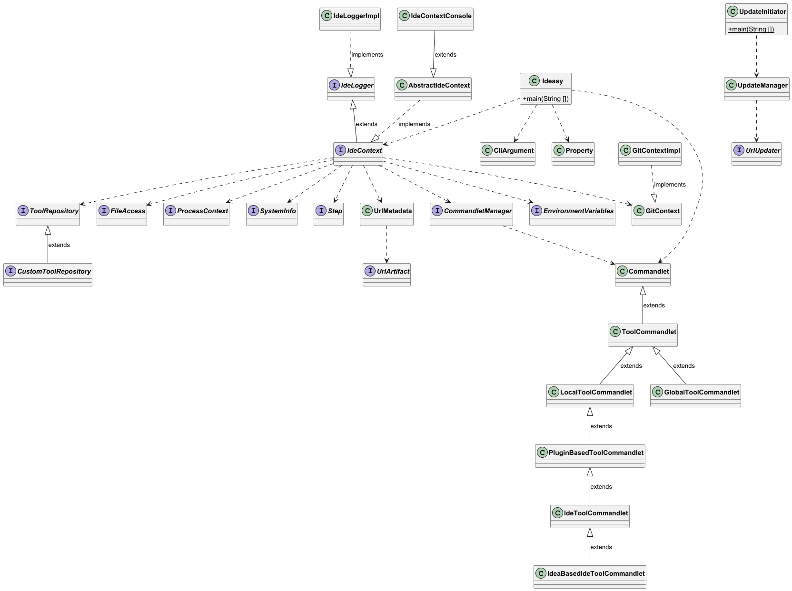

:toc:
toc::[]

= IDEasy Development Setup Guide


Before you can contribute to IDEasy, you need to set up your local development environment.
This section guides you through all required steps — from installation to project initialization — so you can start developing immediately.
Once your setup is complete and everything works as expected, continue with https://github.com/devonfw/IDEasy/blob/main/documentation/IDEasy-contribution-rules-and-guidelines.adoc[Contribution Guidelines] to learn how to work with issues, branches, and pull requests.

== Prerequisites

* *Git* +
Install Git: https://git-scm.com/download/ (only if you do not already have Git installed)

* *A GitHub account* +
Send your GitHub login name/ID via Teams chat to the IDEasy team so they can grant you additional permissions (or to *hohwille*, i.e., https://github.com/hohwille/).

* *IDE* of your choice +
We recommend *IntelliJ*. Install it from: https://www.jetbrains.com/idea/download/?section=windows

NOTE: Please note that the following installation and setup steps are described primarily for *Windows* and *IntelliJ*. Other operating systems or IDEs may require slightly different steps.


== Installation of IDEasy

To start developing IDEasy, you must first install it on your computer.

*Quick start*: +
Download the latest release of IDEasy https://github.com/devonfw/IDEasy/releases[here]. +
Extract the contents of the downloaded archive (`ide-cli-*.tar.gz`) to a new folder and run `setup` in this folder (on Windows, double-click `setup.bat`).

For details, see the link:setup.adoc[setup guide].


== Set up the Development Environment

. After the IDEasy installation, run the following command in the terminal to create a project:
+
```
ide create IDEasy -
```
Wait until this process has finished (this will take several minutes). +
This should create an IDEasy folder inside your `projects` folder (e.g., `D:\projects\IDEasy`) populated with the project. +
On Windows, for example, under `C:\Users\«username»\projects`. If the `projects` folder does not exist, IDEasy will create it automatically and store the project there.

. Fork the https://github.com/devonfw/ideasy[IDEasy] repository. +
Create a fork by expanding the split button (left of the repo name, between *Watch* and *Star*) and choosing *Create a new fork*, so you get your own copy of IDEasy on GitHub. +
+
NOTE: Steps for forking or cloning repositories, creating branches, and using Git commands can be found in the https://github.com/firstcontributions/first-contributions[first contributions guideline].

. Inside the IDEasy folder in `projects\IDEasy`, navigate to `workspaces/main` in Windows Explorer. +
Right‑click on it and choose *Open Git Bash here* (on Windows 11 use *More options → Open Git Bash here*). +
Run this command:
+
```
icd -p IDEasy -w
```

. Clone your fork in there:
+
```
git clone https://github.com/«my-github-login»/IDEasy.git
```

. Configure your Git environment and connect your fork to the official IDEasy repository (upstream):
+
```
git remote add upstream https://github.com/devonfw/ideasy.git
git fetch upstream
```
+
NOTE: Make sure your Git configuration matches your GitHub account:
+
```
git config user.name "«my_github_login»"
git config user.email "«my_github_user_email»"
```

. Now you can open the project in your preferred IDE using the `ide` command. +
For IntelliJ:
+
```
ide intellij
```


. If your IDE does not automatically detect the Maven project structure, you must add it manually. +
In IntelliJ, navigate to the IDEasy folder inside your main workspace directory, locate the `pom.xml` file, right‑click it, and select **Add as Maven Project**.
+
TIP: If the Maven button is hidden or not visible, press `Alt+7` to open the **Structure** window below the project explorer. +
Scroll down in the explorer to make the `pom.xml` file appear higher, enabling the option to be clicked. +
Alternatively, use the keyboard arrows to navigate to the bottom of the right‑click menu.

. To build the project and download all dependencies, run:
+
```
ide mvn clean install
```
+
You can run this in any terminal, or directly in your IDE’s terminal. +
In IntelliJ, click the **Terminal** tab at the bottom (or press `Alt+F12`). +
Make sure your terminal’s current directory is `workspaces/main/IDEasy` before running the command.

Your setup is now complete. Before you start contributing, we recommend reviewing the documentation to get familiar with the IDEasy project. Afterwards, you can continue with the  https://github.com/devonfw/IDEasy/blob/main/documentation/IDEasy-contribution-rules-and-guidelines.adoc[Contribution Guidelines].

== Documentation

When reading this guide online on GitHub, use the left sidebar to navigate the `documentation` directory.
If you are reading this from your local clone, browse the files using your IDE or file explorer.

Please study the documentation, as it explains many important aspects of IDEasy.
As a developer, it is especially important to read the link:coding-conventions.adoc[coding conventions] and link:DoD.adoc[Definition of Done].

Further, browsing the JavaDoc of the source code will help you understand the different types and structures of the project.
For an architectural overview, see the link:images/design.puml[design diagram] (requires PlantUML support, e.g., via IntelliJ plugin). +
The screenshot below shows the UML diagram as of *2026‑02‑19*:




Getting started in IDEasy +
Welcome to the IDEasy project and team!


