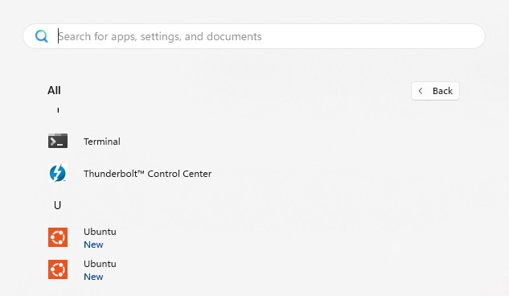
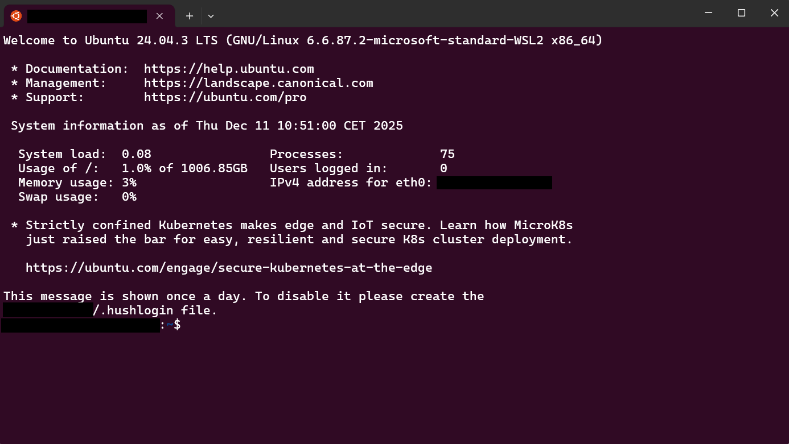
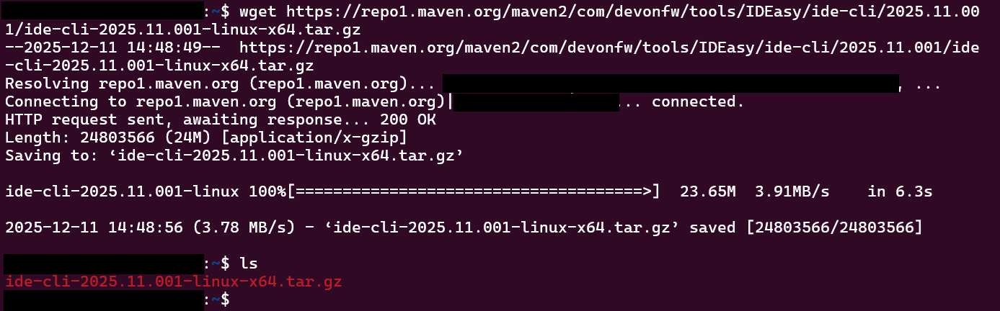

:toc: macro
toc::[]
:idprefix:
:idseparator: -

= IDEasy Installation on Ubuntu in WSL2 (Windows Subsystem for Linux)

== Preparation

=== Install WSL

WSL for Windows can be installed through the Windows terminal (PowerShell, Git Bash, or CMD) using the following command:

----
wsl --install
----

For more details, refer to: https://learn.microsoft.com/en-us/windows/wsl/install[WSL Installation (Microsoft Documentation)]

=== Install Ubuntu from Microsoft Store

Download Ubuntu from the Microsoft Store:
https://apps.microsoft.com/detail/9PDXGNCFSCZV?hl=en-us&gl=DE&ocid=pdpshare[Microsoft Store]

== IDEasy Setup via Ubuntu Terminal

Open an Ubuntu shell on your system.
Ideally you do this via Windows Terminal or by typing `Ubuntu` in the Windows start menu.

.Opening Ubuntu from Windows Start Menu


*All the following steps and commands need to happen inside this Ubuntu terminal.*

.Ubuntu Terminal


=== Prerequisite

Ensure `Git` is installed on your system.
Check by opening Ubuntu via Windows Terminal or directly from the Windows Start menu and running:

```
git --version
```

If `Git` is not installed, use the following command to install `git`:

```
sudo apt install git
```

=== Download and Setup IDEasy

Refer to the detailed setup guide: link:setup.adoc[Setup Instructions].
So inside your Ubuntu shell install IDEasy via the following steps:

1. Copy the Maven link for the *latest* IDEasy release for Linux.
2. Download the file using `wget`:
+
```
wget «link-to-repo»
```
+
Verify the download with the `ls` command; the file should appear if downloaded correctly.
+
```
ls
```
+
.Download and verify files with wget and ls (with an example of link:https://github.com/devonfw/IDEasy/releases/tag/release%2F2025.11.001[2025.11.00 release])

3. Create a new directory `IDEasy` and extract the downloaded file:
+
```
mkdir IDEasy
tar xzf «downloaded-file-name» -C IDEasy
```
+
This extracts the contents into the IDEasy folder.
4. Run the setup script inside the IDEasy folder:
+
```
./IDEasy/setup
```
+
Follow the instructions in the terminal.
5. After installation, reboot the system:
+
```
sudo reboot
```

IDEasy is now installed on your Ubuntu system.
A new directory called `projects` will be automatically created.

== IDEasy Installation for Developers

To set up the development environment, simply follow the guide at link:IDEasy-contribution-getting-started.adoc#installation[Getting started as developer contributing to IDEasy].
