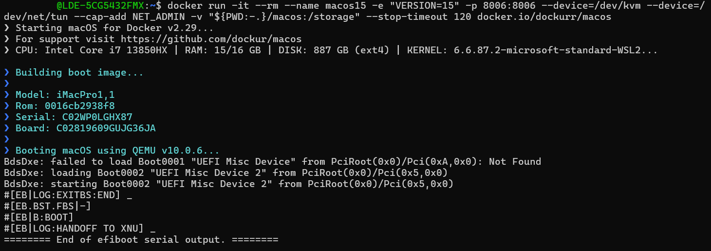
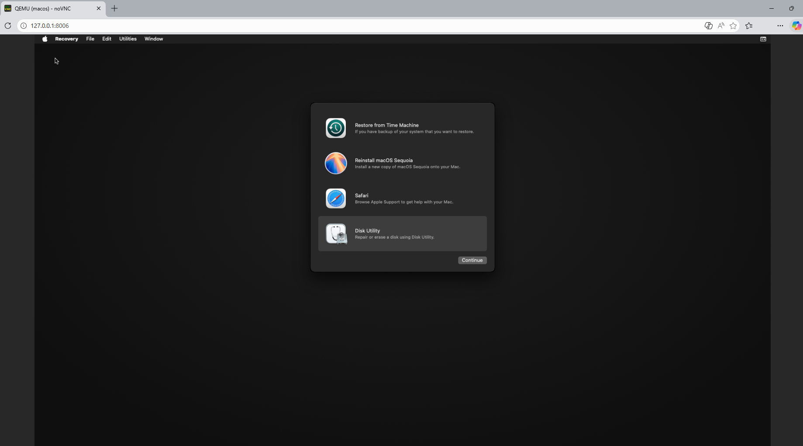

:toc: macro
toc::[]
:idprefix:
:idseparator: -

= IDEasy Installation on a macOS VM

=== Disclaimer

Please be mindful of https://github.com/dockur/macos?tab=readme-ov-file#disclaimer-%EF%B8%8F[dockurr/macos' official disclaimer]: Only run this container on Apple hardware, any other use is not permitted by their EULA.

== Preparation

=== Install WSL

WSL for Windows can be installed through the Windows terminal (PowerShell, Git Bash, or CMD) using the following command:

----
wsl --install
----

For more details, refer to: https://learn.microsoft.com/en-us/windows/wsl/install[WSL Installation (Microsoft Documentation)]

=== Install Docker

To install Docker, use the command:
----
ide install docker
----

Alternatevly, refer to Docker's official guide: https://docs.docker.com/desktop/setup/install/windows-install/[Install Docker Desktop on Windows]

- In order to use the `docker` commands, `Docker Desktop for Windows` should remain open.

=== Setup macOS container

Setup the macOS container following the official guide: https://github.com/dockur/macos[dockur/macos]

Roughly, the steps involve:

1. Creating and initializing the macOS docker container. In WSL, run the command (for example):
+
```
docker run -it --name macos -e "VERSION=15" -p 8006:8006 --device=/dev/kvm --device=/dev/net/tun --cap-add NET_ADMIN -v "${PWD:-.}/macos:/storage" --stop-timeout 120 docker.io/dockurr/macos
```
+
The expected output will look like this:
+


+
Notes:

- The command can be adapted to fit your needs, e.g. set macOS to 14 instead of 15 with `-e "VERSION=14"`.
 
- If you plan to reuse the VM, avoid using the `--rm` flag.

- For further details, refer to the official documentation: https://github.com/dockur/macos[dockurr/macos].
+

2. To access the macOS VM: navigate to http://127.0.0.1:8006/ on a web browser.
+
On the first startup of the macOS VM, it will look like this:
+


3. Setup macOS following the steps listed in the official guide's https://github.com/dockur/macos?tab=readme-ov-file#faq-[FAQ].

== Setup IDEasy in the macOS VM

Refer to the detailed setup guide: link:setup.adoc[Setup Instructions].

So, inside the macOS VM (accessible through the web browser) install IDEasy via the following steps:

1. Install `homebrew`. In macOS' terminal, run:
+
```
/bin/bash -c "$(curl -fsSL https://raw.githubusercontent.com/Homebrew/install/HEAD/install.sh)"
```
+
For more details, here's the official guide: https://brew.sh/[brew.sh]
2. Install `Git for macOS`. In macOS' terminal, run:
+
```
brew install git
```
+
For more details, here's the official guide: https://git-scm.com/install/mac[Git for macOS]
+
3. Download IDEasy for macOS:
+
The latest release of `IDEasy` can be downloaded from https://github.com/devonfw/IDEasy/releases[here].
4. Extract the contents of the downloaded archive (`ide-cli-*.tar.gz`) to a new folder.
5. Refer to link:mac-gatekeeper.adoc[Gatekeeper problem and workaround] in order to allow the installation of IDEasy.
6. Install IDEasy by running `setup`.

IDEasy is now installed on your macOS VM!

A new directory called `projects` will be created automatically.

== IDEasy Installation for Developers

To set up the development environment, simply follow the guide at link:IDEasy-contribution-getting-started.adoc#installation[Getting started as developer contributing to IDEasy].

== Further notes
=== Stop the macOS VM
To stop the macOS VM, open WSL in the host system and run:
```
docker stop macos
```
If you can't recall the container's name, run `docker ps` to see a list of running containers.

=== Restart the macOS VM
- If the `--rm` flag was used in the `docker run ...` command: simply run `docker start macos` and the macOS session will be restored. If you can't recall the container's name, run `docker ps -a` to see a list of saved containers.
- If the `--rm` flag was used in the `docker run ...` command: run the full `docker run ...` command again. In this case you may need to setup macOS from scratch.
