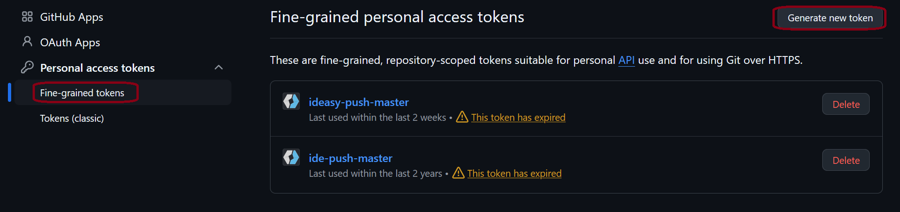
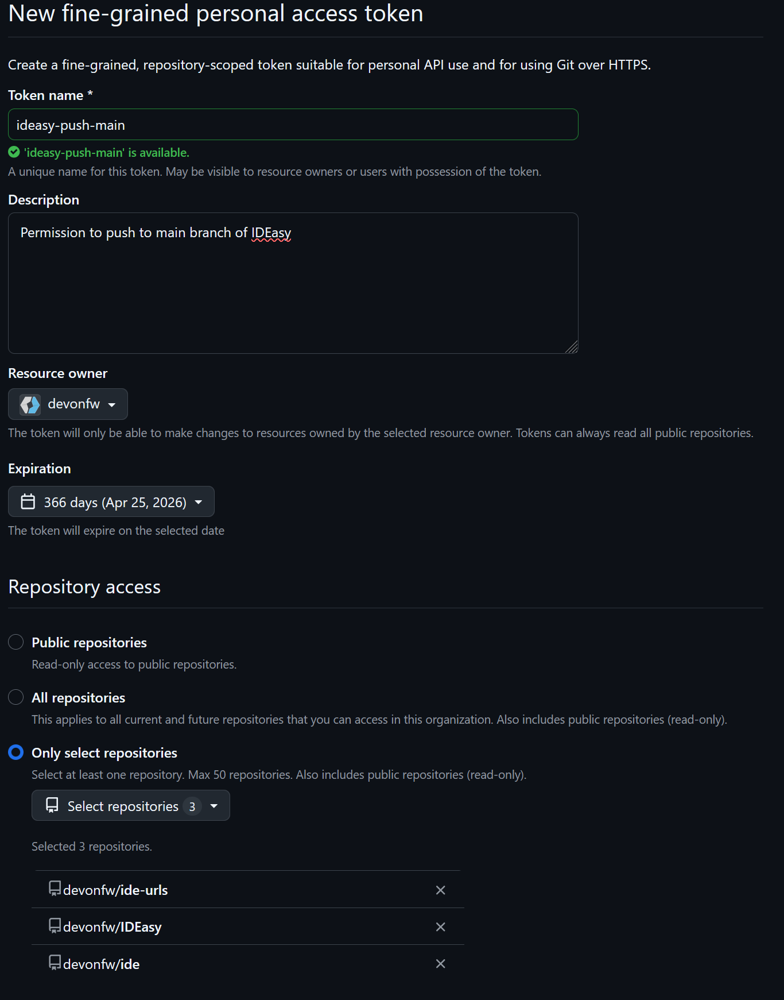
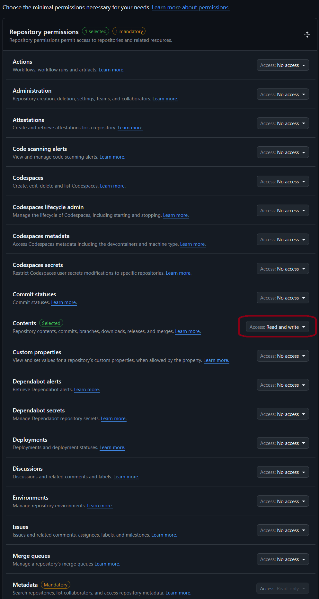
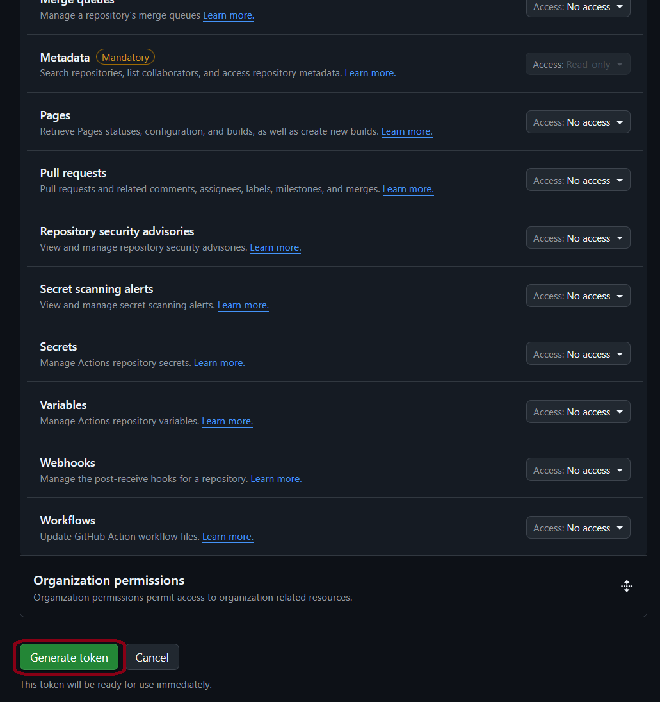
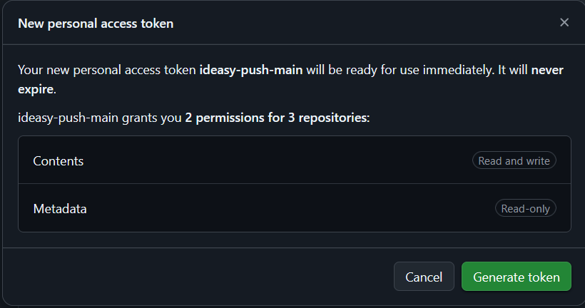
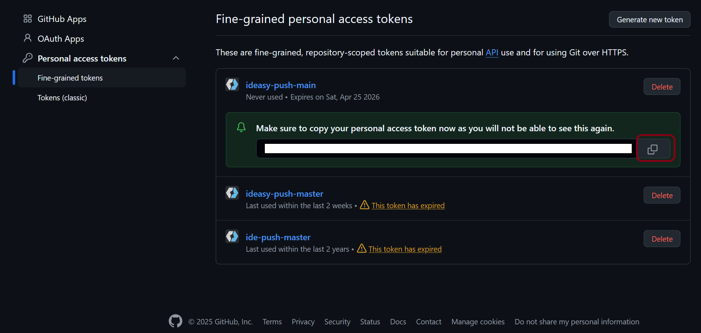
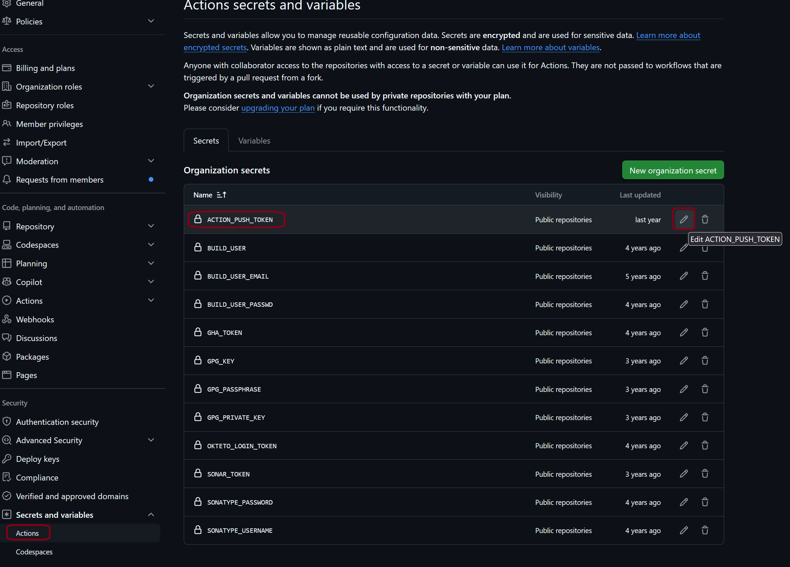
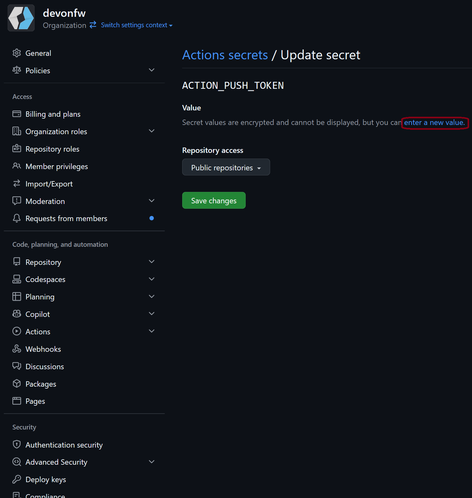
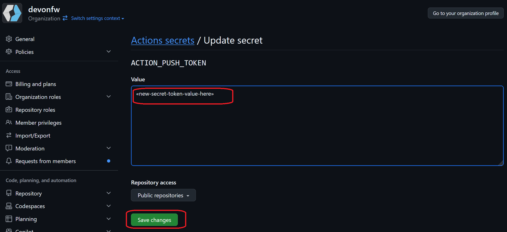

:toc: macro
toc::[]

== Update GitHub Access Token

To allow GitHub actions writing to our project (e.g. pushing changes) we need a fine-grained access token.
Such token needs the according permissions and due to a GitHub policy it must expire after some time.
When the expiry date is reached, out actions will fail.
Therefore, shortly before this expiry date the token has to be replaced by a new one (refreshment).
The creator of the token will receive an email several weeks before the expiry date as a reminder.

This guide documents the process of the token refreshment so the knowledge can not get lost.

=== Generate new Access Token

Go to https://github.com/settings/personal-access-tokens[] to get started.

On that page you can see your existing access tokens with their name.
Click on `Generate new token` to create a new token.

Enter the following data

* a unique name for the new token
* ensure the organization is set as `Resource owner`
* set `Expiration` to the maximum possible value (1 year)
* choose `Only select repositories` and select the repositories our actions need to access (`IDEasy` and `ide-urls`).
* in `Repository permissions` select `Read and write` for `Contents`.

 +
 +
 +

 +
 +
 +

Click on `Generate token` to proceed.

 +
 +
 +

 +
 +
 +

On the confirmation page click again on `Generate token` to proceed.

 +
 +
 +

 +
 +
 +

Now the token has been generated.
It can be copied from the current page but only from here.
Ensure that you copy it to a secure location (e.g. KeePass) before closing this screen.
You will never get the ability again from GitHub to copy the secret value of your token!

=== Update GitHub Secret to new token

From the https://github.com/organizations/devonfw/settings/secrets/actions[secrets page of our organization] we need to update the 
https://github.com/organizations/devonfw/settings/secrets/actions/ACTION_PUSH_TOKEN[ACTION_PUSH_TOKEN].

 +
 +
 +

 +
 +
 +

Select the `ACTION_PUSH_TOKEN`.

 +
 +
 +

 +
 +
 +

Click on `enter a new value`.

 +
 +
 +

 +
 +
 +

Finally, copy your new secret token value into the text area and click on `Save changes`.

Observe our GitHub Actions the next day and carefully observe if all is working fine.