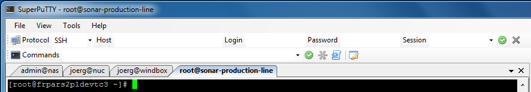

:toc: macro
toc::[]

= Windows Tooling

== Installing software

The IDEasy already supports a lot of software tools.
But if you need more, here are some ways to get it easily:

=== Chocolatey

https://chocolatey.org/[Chocolatey] is a repository for free and open source software similar to the repositories know from the Linux like apt, apk, pacman, ...

=== WinGet

Microsoft is also working on a repository for Windows called https://github.com/microsoft/winget-cli[WinGet].
It is currently in a pre-release state, but is expected to be integrated in the upcoming Windows versions.

== Tabs everywhere

Many people got used to _tabs_ that have been introduced by all major browsers:

.Tabs in Firefox
image::images/tools-tabs-firefox.png["tabs in firefox"]

This nice feature can be added to many other tools.

=== Tabs for Windows Explorer

Since Windows 11 the Windows Explorer supports Tabs.

.Tabs in Windows Explorer
image::images/tools-tabs-explorer.png["tabs in windows explorer"]

=== Tabs for SSH

If you want to have tabs for your SSH client http://www.putty.org/[Putty] (or even better http://www.9bis.net/kitty/[Kitty] that comes with https://winscp.net/[WinSCP] integration) you simply install https://github.com/jimradford/superputty#superputty-application[SuperPutty]
BTW: Windows 10 has already an SSH client included.

.Tabs for SSH


=== Tabs for Shells

If you want to use different shells like CMD, Powershell, git-bash, WSL, SSH, etc. via tabs inside one window, then use https://github.com/microsoft/terminal[Windows-Terminal] that can simply be installed for free via `Microsoft Store`.

.Tabs for multiple shells inside one window


For perfect integration, you should (re-)install `git` after Windows-Terminal has been installed and check the option `Add a Git Bash Profile to Windows Terminal` or follow the https://www.timschaeps.be/post/adding-git-bash-to-windows-terminal/[manual integration].

.Integration of git-bash into Windows-Terminal
image::https://mobeigi.com/_next/image/?url=%2Fapi%2Fmedia%2Ffile%2Fgit-installer-windows-terminal-profile.webp&w=1200&q=75["Intergate git-bash into Windows-Terminal"]

You can even open SSH sessions and WSL distributions from the context menu of `Windows Terminal` in a tab.

== Windows Helpers

=== Handle passwords

Do you want complex passwords that differ for each account for security?
Do you only want to remember a single password for simplicity?
Do you want to have both?
Then, you need to install https://keepass.info/[KeePass] right now.

=== Real text editor

A real developer needs a real text editor and not windows built in `notepad`.
The most common choice is https://notepad-plus-plus.org/[Notepad++].

=== Real compression tool

Do you need to deal with ZIP files, TGZ, dpkg, etc.?
Just install http://www.7-zip.org/[7zip] and forget about windows build-in ZIP support (that is buggy with long file paths, etc.).

=== Smarter clipboard

Do you want to paste something from the clipboard but meanwhile you had to copy something else?
On Windows 11 just press [Win][v] to open a popup with the history of your clipboard.
If you still want more you might try http://ditto-cp.sourceforge.net/[ditto].

=== PowerToys

Microsoft provides some extensions to improve the workflow in windows called https://github.com/microsoft/PowerToys[PowerToys].
The include tools like a file renamer, a way to order your windows on the screen, a color picker and more.

=== Sysinternals Tools

A real developer will quickly notice that windows build in tools to analyze processes, network connections, AutoStarts, etc. are quite poor.
So, what you really would like is the https://docs.microsoft.com/en-us/sysinternals/downloads/sysinternals-suite[Sysinternals-Suite].
You can make process-explorer your https://www.ricksdailytips.com/make-process-explorer-default-task-manager/[default task manager].
Use AutoRuns to prevent nasty background things to be started automatically.
Use TCPView to figure out which process is blocking port 8080, etc.

=== Cope with file locks

Did you ever fail to delete a file or directory that was locked by some process, and you did not even know which one it was?
Then you might love https://www.iobit.com/en/iobit-unlocker.php[IoBit Unlocker].
Also `ProcessExplorer` from SysInternal Tools (see above) allows to find locks via `Find` menu option `Find handle or DLL...`.
Here you can paste the path to the locked file and click `Search` to find the process owning the lock and can terminate the process.
See also https://www.howtogeek.com/128680/HOW-TO-DELETE-MOVE-OR-RENAME-LOCKED-FILES-IN-WINDOWS/[this article].

=== Create symbolic links

Are you used to symbolic and hard links in Linux?
Do you have to work with Windows?
Would you also like to have such links in Windows?
Why not?
Windows https://www.howtogeek.com/howto/16226/complete-guide-to-symbolic-links-symlinks-on-windows-or-linux/[supports real links] (not shortcuts like in other cases).
If you even want to have it integrated in Windows explorer you might want to install http://schinagl.priv.at/nt/hardlinkshellext/linkshellextension.html[Link Shell Extension].
However, you might want to disable SmartMove in the http://schinagl.priv.at/nt/hardlinkshellext/hardlinkshellext.html#configuration[configuration] if you face strange performance issues when moving folders.

=== Linux

Windows contains the Windows Subsystem for Linux (WSL) that allows you to easily run a linux inside your Windows operating system.
Unlike running a full-fledged VM this is very lightweight and fast.
Simply go to Windows Store and install Ubuntu with a few clicks.
You can even run it in a tab in Windows Terminal.

Also get used to use bash. Git for Windows ships with the MINGW based git-bash.
This supports auto-completion and many useful features.
Since bash is available for Windows, Linux, and MacOS, it is very convenient to get used to bash and work in the same way on any OS.
We highly recommend to make this your default in `Windows Terminal` and only use `CMD` or `Power Shell` when really needed.
In case you need even more Linux features natively into your Windows host, you might want to install https://www.cygwin.com/[Cygwin].
This allows you to install ssh with ssh-agent and all the Linux tools you love (or hate).

=== X11

Do you want to connect via SSH and need to open an X11 app from the server?
Do you want to see the GUI on your Windows desktop?
No problem: Install https://sourceforge.net/projects/vcxsrv/[VcXsrv].

=== Keyboard Freak

Are you a keyboard shortcut person?
Do you want to have shortcuts for things like « and » ?
Then you should try https://www.autohotkey.com/[AutoHotKey].
For the example (« and ») you can simply use this script to get started:

```
^<::Send {U+00AB}
^+<::Send {U+00BB}
```

First, just press `[ctrl][<]` and `[ctrl][>]` (`[ctrl][shift][<]`).
Next, create shortcuts to launch your IDE, to open your favorite tool, etc.
If you like a GUI to easily configure the scrips, that comes with a lot of extensions preinstalled, you should have a look at https://activaid.telgkamp.de/[Ac'tiveAid].

=== Paint anywhere on your desktop

Do you collaborate sharing your screen, and want to mark a spot on top of what you see?
Use http://epic-pen.com/[Epic Pen] to do just that.

=== Analyze graphs

Do you need to visualize complex graph structures?
Convert them to https://en.wikipedia.org/wiki/Trivial_Graph_Format[Trivial Graph Format] `(.tgf)`, a run https://www.yworks.com/products/yed[yEd] to get an interactive visualization of your graph.

=== Up your screen capture game

Capture any part of your screen with a single click, directly upload to dropbox, or run a svn commit all in one go with http://getgreenshot.org/[GreenShot].
Another screen capture tool where you can easily manage and edit your screenshots and also do screen recordings with is https://www.screenpresso.com/download/[Screenpresso].

=== Fast Search in Windows

https://voidtools.com/[Everything] is a desktop search utility for Windows that can rapidly find files and folders by name.
