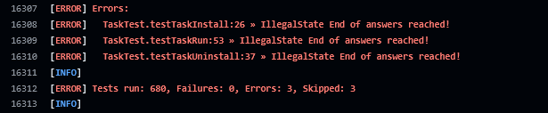

= FAQ

In this section, you can find answers to frequently asked questions regarding contributing to the IDEasy project, as well as some tips and tricks for a smooth development experience.

== Tips and tricks

Have a look at https://github.com/devonfw/IDEasy/blob/main/documentation/advanced-tooling-generic.adoc[advanced-tooling-generic.adoc] for some helpful developer tools.

=== Known CI Build Errors & Quick Fixes

Committing and pushing changes triggers the CI Build PR / build (pull_request) workflows.
The workflows can fail due to predictable issues that are easy to resolve.
Here is a common example:

==== Error: IllegalState End of answers reached!

If your CI build fails during PR / build (pull_request) with an error message like this:

[source]
----
IllegalState End of answers reached!
----

This error often occurs for specific tests when there are missing executable permissions on certain scripts or resource files.

*Fix:*
You can fix this issue by restoring the executable flag using the following command (replace PATH_TO_FILE with the path to the file that needs the executable permission):

[source,bash]
----
git update-index --chmod=+x PATH_TO_FILE
----

After making this change, commit and push your changes, and the CI build should proceed successfully.

