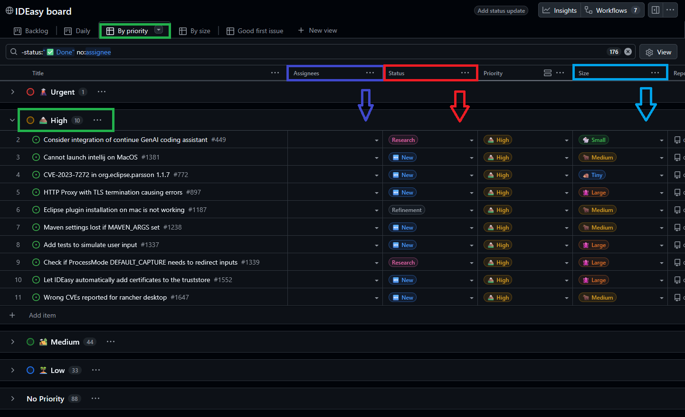

= Project Board

The https://github.com/orgs/devonfw/projects/5/views/6?filterQuery=[IDEasy Board] organizes our agile workflow using several columns.
Each column represents a specific state in the lifecycle of an link:issue.adoc[issue] or link:pull-request.adoc[pull-request]:

* `New`:
**link:issue.adoc[Issues]** that are available in the backlog and have not been started yet.
They should have the key metadata set:
- **Priority**: Indicates how important or urgent the issue is.
Issues with higher `Priority` should typically be addressed first.
- **Size**: Represents the estimated complexity or effort (e.g., Small, Medium, Large).
Issues with higher `Size` are typically more complex.
Depending on your experience consider if you want to deal with the story or check if easier tasks are therefore you to work on first.
* `Research`:
**link:issue.adoc[Issues]** or **link:pull-request.adoc[PRs]** that are blocked or require deeper analysis before implementation can continue.
These items often involve unclear requirements or technical challenges.
Typically, they have been already started by some other developer who had to give up at some point being unable to solve the problem.
* `Refinement`:
**link:issue.adoc[Issues]** that have been created but are not fully clarified for implementation.
E.g. if there are questions or choices still to be decided the issue cannot be implemented yet.
* `In Progress`:
**link:issue.adoc[Issues]** that are actively being worked on.
An issue in this column should have at least one assignee.
If a pull request exists for the issue, it will be linked with the issue.
If no PR exists yet, the implementation is still ongoing.
* `Team Review`:
**link:pull-request.adoc[PRs]** that are currently under review by a member of the development team.
The reviewer and the PR author are both listed as assignees.
Once all review comments are resolved, the reviewer moves the PR to *In Review*.
* `In Review`:
**link:pull-request.adoc[PRs]** awaiting or undergoing final review.
Typically performed by the Project Owner (currently `hohwille`) or a senior team member.
Both reviewer and author remain listed as assignees.
* `Done`:
[.underline]#Issues# or [.underline]#Pull requests# that have been fully completed and merged.

NOTE: To keep the board clean and avoid overload, **only pull requests** are allowed in the review columns.
Issues stay in *In Progress* until their corresponding pull request has been merged.
The merge will automatically close both the PR and the issue and set both to `Done`.

=== Example Project Board

Below is an example view of the board to help you identify the most important fields:

* *Priority* (green) +
* *Status* (red) +
* *Assignees* (purple) +
* *Size* (blue) +

