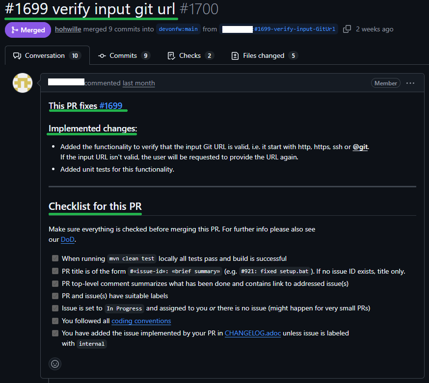

= Pull Request

A Pull Request (PR) is the final step of contributing your work to the IDEasy project.
It is used to propose changes, request feedback, and start the review process before your code can be merged into the `main` branch of the original repository.

You should create a Pull Request once your implementation is complete, committed, and pushed to your feature branch.

We have prepared a nice template for PRs but you still need to adjust the following aspects:

* Replace `TodoIssueID` with the reference to the implemented issue e.g. #1699
* Below `Implemented changes` provide a simple bullet list that summarizes your changes briefly.
Do not describe implementation details but just the high-level design aspects that help to understand the diff better (esp. on large or complex changes).
* There are two check-lists in the PR template.
If your PR does not add a new commandlet, simply remove the second check-list before creating the PR.
Also do not try to fill out the checklist (with `x`) before finally creating the PR.
After the PR is created, you can simply check or uncheck the items from the checklist.
* Adapt the PR `title` to follow the format `#«issue-id»: «brief summary»`.
Typically, this will happen automatically, if you follow our link:commit.adoc[commit conventions].
Otherwise, simply edit and adapt the title accordingly (e.g. removing potential `feature/` prefix).
* Assign yourself to the PR so it will show up on our link:project-board.adoc[project-board].
* Assign suitable labels to your PR so it gets easier to find it later.
* After the PR has been created, it should automatically be associated with `IDEasy board`.
Change the status to `Team Review`.
In the next daily call ask your teammates who can do such review and ensure the reviewer gets set as additional assignee - not (only) as reviewer, since only then the PR will appear on the board also for the reviewer.
After the team review is completed, the status has to be advanced to `In review`.

== Example

To illustrate how a **Pull Request** should look, see the example screenshot below:

== Draft Mode

A Pull Request can also be created in *draft mode* if your changes are not yet ready for review (e.g. Work in Progress).
Creating a draft PR can be helpful when:

* you want to receive _early feedback_
* you are working on a _larger feature_ and need intermediate visibility
* your work may need to be _handed over_ unexpectedly (e.g., sickness), so teammates can continue with your current progress

If the PR *was created as a draft*, then once the description is complete and all DoD items are addressed, scroll to the bottom of the PR and click `Ready for review`.
This will move the PR out of draft mode.

== Contributor License Agreement

For your **first contribution** to IDEasy, you must sign the link:cla.adoc[Contributor License Agreement (CLA)].

**Without signing the CLA, your PR cannot be merged!**

== Review

After creating the Pull Request and completing the link:DoD.adoc[DoD], the review process begins.
Please follow these rules to ensure a smooth and transparent collaboration:

* **Requested changes and conversations** should only be marked as *Resolved* by the person who started them, not by the PR creator.
**Exception:** If permissions do not allow this, the PR creator may add a final comment like *“This can be resolved now”*.

* **Conversations must always be answered by the PR owner** to show whether the suggestion was implemented or acknowledged.

* The **PR should always have the correct assignees**:
**the owner of the PR and the reviewer**.
This shows who is currently responsible.

* A PR **should not be in draft mode during review**.
Before requesting a review, ensure the PR is out of draft mode.

