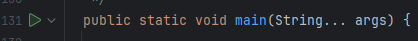
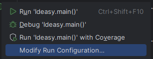
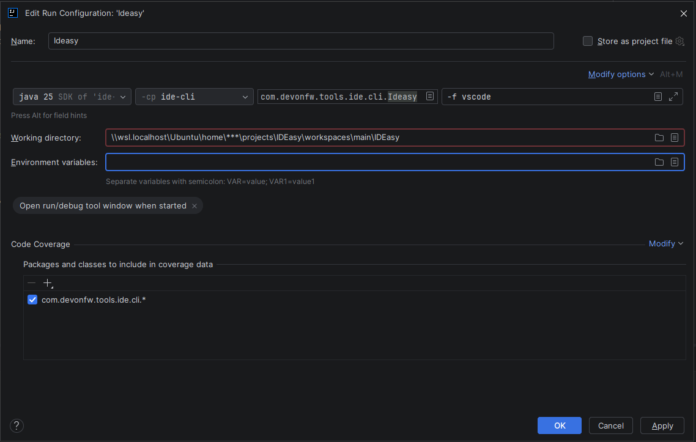

= Run IDEasy locally
:toc: macro

In order to test changes you did locally in your feature branch, there is a need for running IDEasy locally from the branch with the local changes applied.
To achieve this, there are multiple options. These include running IDEasy from inside an IDE such as IntelliJ or Visual Studio Code, which also enables debugging with breakpoints and many more features.

toc::[]

== Run IDEasy locally from inside Intellij

The entrypoint for running your local changes of IDEasy is the main-method in the cli-subfolder. Since most of the functionality of IDEasy is located in the cli-submodule, this will cover nearly all the local running/testing needs.
The main-method is located in `com.devonfw.tools.ide.cli.Ideasy`. Since running the main-method without any arguments is not really useful, it is necessary to create a run configuration
in Intellij for this module/method.

The easiest way to create such a run configuration is clicking on the "run/play" button to the left of the main-method definition and then click on "Modify run configuration":

In the window that is then opened, some configurations have to be made (if not set automatically already):

* Set the used SDK to the SDK of the project
* Set module to `ide-cli`
* Set Main class to `com.devonfw.tools.ide.cli.Ideasy`
* In Program arguments, add the cli arguments you want to pass to IDEasy (in the example a call to open vscode with the force-option)
* Set Working directory to the IDEasy project folder

With this, you should have a working run configuration which starts IDEasy from your local branch with the provided arguments.
When you want to test other functionality of IDEasy, change the Program arguments in the run configuration accordingly.

This shows an example run configuration for IDEasy:

=== Debug IDEasy in Intellij

With the just created run configuration, we can also now use the debugger in Intellij to debug IDEasy using breakpoints.

Just set breakpoints anywhere in the code and then use the "Debug" button with the run configuration.

== Run IDEasy locally from inside Visual Studio Code

Running IDEasy from inside Visual Studio Code works similarly to IntelliJ and also supports debugging with breakpoints.
It requires the https://marketplace.visualstudio.com/items?itemName=vscjava.vscode-java-pack[Extension Pack for Java] to be installed in VS Code.

To create a launch configuration, create or open the file `.vscode/launch.json` in the root of the IDEasy project and add the following configuration:

[source,json]
----
{
  "version": "0.2.0",
  "configurations": [
    {
      "type": "java",
      "name": "IDEasy",
      "request": "launch",
      "mainClass": "com.devonfw.tools.ide.cli.Ideasy",
      "projectName": "ide-cli",
      "args": "install mvn",
      "cwd": "${workspaceFolder}"
    }
  ]
}
----

The relevant settings are:

* `mainClass`: must be set to `com.devonfw.tools.ide.cli.Ideasy`
* `projectName`: must be set to `ide-cli`
* `args`: the CLI arguments to pass to IDEasy (in the example, a call to install Maven)
* `cwd`: the working directory, set to the IDEasy project root

With this configuration saved, open the *Run and Debug* panel (kbd:[Ctrl+Shift+D]), select *IDEasy* from the dropdown, and click the run button.
When you want to test other functionality of IDEasy, change the `args` value in `launch.json` accordingly.

=== Debug IDEasy in Visual Studio Code

With the launch configuration in place, debugging works out of the box.
Set breakpoints anywhere in the code and start the configuration using the *Debug* button in the *Run and Debug* panel.

== Run IDEasy locally from the command line using a JAR

As an alternative to running IDEasy from inside an IDE, it is also possible to build a runnable JAR and launch it directly from the command line.
This approach is useful when you want to test your local changes without opening an IDE, or when running IDEasy in a scripted environment.

All commands below are executed from inside the `cli` subdirectory of the project.

=== Step 1: Build the JAR

Run a full Maven build to compile the project and produce the JAR:

 mvn clean install

The resulting JAR is placed in `cli/target/` and named `ide-cli-<revision>.jar`, where `<revision>` matches the value defined in `.mvn/maven.config`.

=== Step 2: Copy runtime dependencies

The JAR does not bundle its dependencies. Copy them to `target/lib/` so the JAR manifest can resolve them at runtime:

 mvn dependency:copy-dependencies -DoutputDirectory=target/lib -DincludeScope=runtime

=== Step 3: Run IDEasy

Launch IDEasy with the desired CLI arguments. Replace `<revision>` with the actual revision string (e.g. `2026.05.001-SNAPSHOT`):

 java -jar target/ide-cli-<revision>.jar <args>

For example, to install a tool:

 java -jar target/ide-cli-2026.05.001-SNAPSHOT.jar install mvn

When you want to test other functionality of IDEasy, change the CLI arguments accordingly.

== Build IDEasy as a GraalVM native binary

IDEasy can also be compiled to a native binary using GraalVM's native image feature.
This results in a self-contained executable with fast startup time and no JVM dependency, which is the same build used for official IDEasy releases.

For step-by-step instructions on how to set up GraalVM and build the native image locally, see the xref:graalvm-build-guide.adoc[GraalVM Build Guide].
