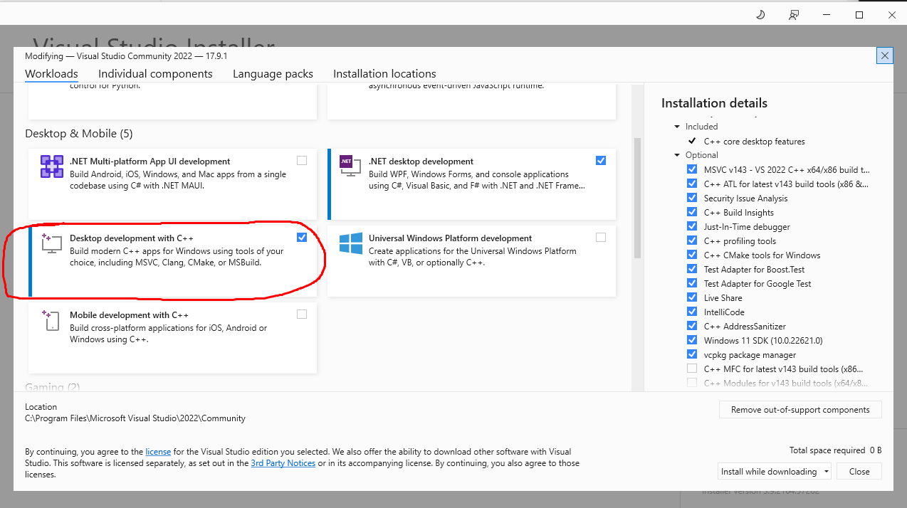
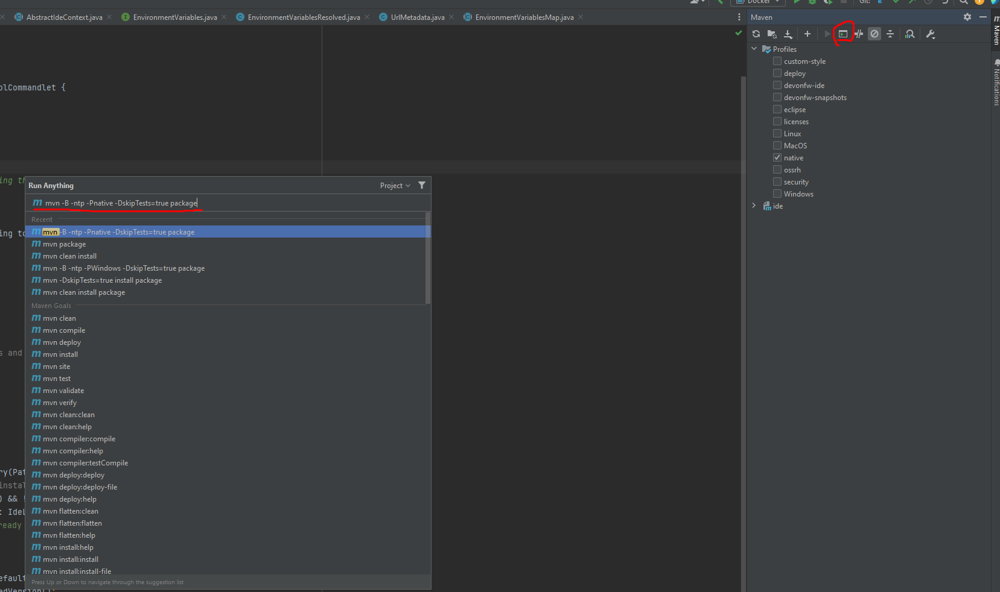

= Graalvm Build Guide

*1. Setup Graalvm*

```
icd IDEasy
ide install graalvm
```
When the installation is complete, the GRAALVM_HOME environment variable is automatically set to the graalvm installation path e.g. C/Projects/IDEasy/software/extra/graalvm

*2. Install Dependencies*

*2.1 Windows: Install Visual Studio*

* Download Visual Studio from https://visualstudio.microsoft.com/downloads/

* During the installation, make sure to include the "Desktop development with CPP" workload, as this includes the necessary C/C++ compiler


* If you already have Visual Studio installed, open the Visual Studio installer and click “modifyˮ on your existing installation.
Then select the C++ workload and click on install.

*2.2 Linux*

Install the zlib development package on your system:

```
sudo apt-get update +
sudo apt-get install zlib1g-dev
```

*3. Build Your Application*

Run the following Maven command inside Intellij to compile your application and create an executable:

```
icd -w main
cd IDEasy/cli
mvn -B -ntp -Pnative -DskipTests=true package
```



Building the application might take up to 10 minutes depending on your machine.

[[reflection-configuration]]
*4. Reflection Configuration*

GraalVM native images require explicit registration of classes that use reflection.
Jackson JSON deserialization uses reflection to instantiate and populate objects.

*4.1 Automated Validation*

Before building a native image, validate that all JSON classes are properly registered:

```
mvn test -Dtest=GraalVmReflectionConfigTest
```

This test ensures all JSON classes implementing `JsonObject` or `JsonVersionItem` are registered in `reflect-config.json`.

*4.2 Adding New Tools with JSON APIs*

When adding a new tool that fetches JSON from external APIs (like npm, pip, or GitHub):

1. *Create JSON model classes* implementing `JsonObject` or `JsonVersionItem`
2. *Run the reflection test* to detect missing registrations:
+
```
mvn test -Dtest=GraalVmReflectionConfigTest
```
+
3. *Update reflect-config.json* - If the test fails, it will show a helpful error message with the exact JSON snippet to add. Copy the snippet from the error message and paste it into:
+
```
cli/src/main/resources/META-INF/native-image/com.devonfw.tools.IDEasy/ide-cli/reflect-config.json
```
+
4. *Re-run the test* to verify it passes
5. *Build native image* to confirm everything works

*4.3 Manual Registration*

If you need to manually register a class for reflection, add an entry to `reflect-config.json`:

```json
{
  "name": "com.devonfw.tools.ide.mytool.MyJsonObject",
  "allDeclaredConstructors": true,
  "allPublicConstructors": true,
  "allDeclaredFields": true,
  "allDeclaredMethods": true
}
```

*4.4 Common Errors*

*Error:* `InvalidDefinitionException: cannot deserialize from Object value` or `cannot construct instance` in native image

*Cause:* Missing reflection config for JSON classes

*Solution:* Run `GraalVmReflectionConfigTest` to identify missing classes, then add them to `reflect-config.json` as shown above

*Error:* `No serializer found for class` in native image

*Cause:* Missing serialization config (rare, usually only reflection needed)

*Solution:* Add serialization config or use explicit custom serializers

*5. Run your Application* +
An ideasy executable (e.g. ideasy.exe under windows) should be created under *../workspace/main/IDEasy/cli/target*.

To run the application open a cli and pass your arguments.

Example:

[width="100%",cols="100%",options="header",]
|===
a|
C:\Projects\IDEasy\workspaces\main\IDEasy\cli\target> .\ideasy.exe mvn --version
|===

