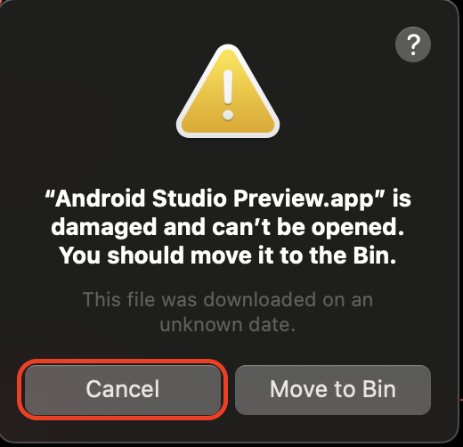
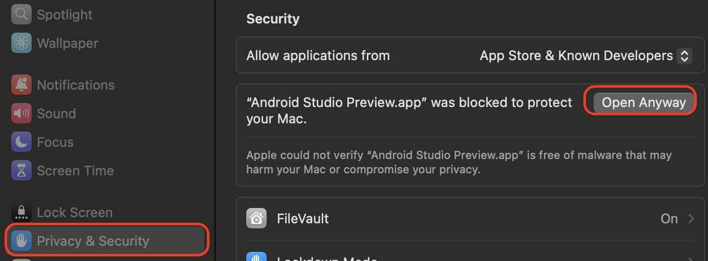
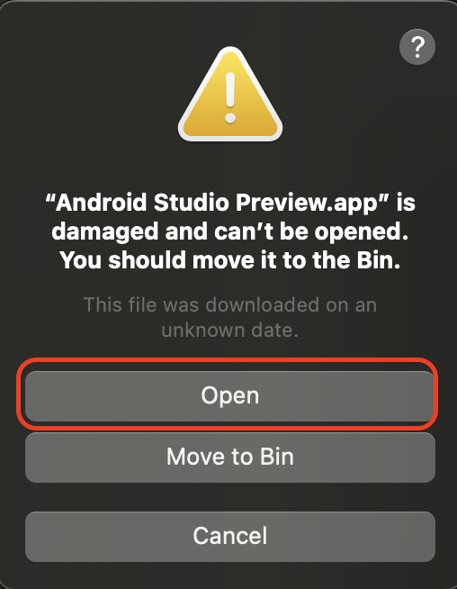
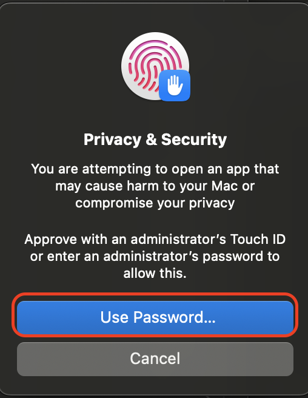
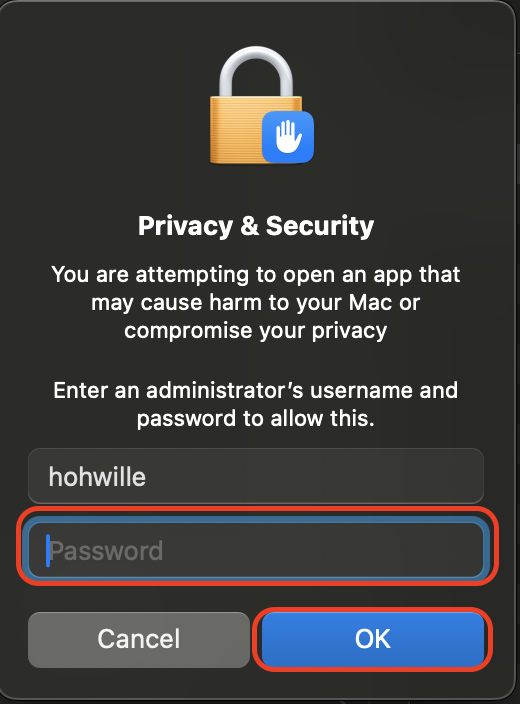

= MacOS Gatekeeper

https://en.wikipedia.org/wiki/Gatekeeper_(macOS)[Gatekeeper] was introduced in MacOS 10.5.
It is a security feature that aims to protect against malware by executing only "trusted" applications.
Therefore, applications have to be signed.
Since many open-source applications provide MacOS releases that are not properly signed, there is a problem.

For details see https://support.apple.com/en-us/HT202491/[Safely open apps on your Mac]
https://support.apple.com/guide/security/sec5599b66df/web[Gatekeeper and runtime protection in macOS] but also https://disable-gatekeeper.github.io/[disable-gatekeeper].

== Problem

In case an application is not properly signed and Gatekeeper is active on your Mac, you will see the following popup:

If you click on `Move to Bin` the application you downloaded will be moved to the trash bin.
In case you want to run an application that is not "trusted" by Gatekeeper, you can only click `Cancel` here.

You could globally disable Gatekeeper, but this will entirely disable this security protection.
If you have a corporate MacBook this does not seem to be a reasonable option and will typically be prevented by some policy.
The following section documents a workaround how you can manually trust a single application and permit it to be executed.

== Workaround

Before applying this workaround please check that the application was downloaded from the proper source that you trust and verify its signature hash.
Please note that if the application was downloaded by IDEasy it is automatically verifying the signature hash for you and will fail if the has does not match the expected value.
Then you can proceed as following:

After you saw the screenshot above and pressed `Cancel`, you can do the following workaround:

1. Open your `System Settings`
2. Select `Privacy & Security`
3. Scroll down to the bottom (section `Security`), find your cancelled application and click `Open Anyway`
+

4. Confirm the popup with `Open`
+

5. Select `Use Passwprd...`
+

6. Enter your password and confirm with `OK`
+

== Status

Currently, IDEasy itself is not properly signed for Mac and also various other tools supported by IDEasy such as `IntelliJ` or `VSCode`.
For updates of the status see issue https://github.com/devonfw/IDEasy/issues/451[#451].
We are planning to solve this problem so you do not need this workaround for IDEasy itself.
For other tools, there is pretty much nothing we can do, and you have to ask the team or vendor providing such tool to fix the problem.

While this problem exists, Mac users only have the option to do the workaround for every affected application and repeat it whenever a new version of that application gets installed.
This massively reduces the UX of IDEasy on MacOS.

We are sorry for any inconvenience but also want to point out that Apple is doing such changes without very early announcements for developers but rather blocks millions of users by such breaking changes in new MacOS releases.
We still believe that the general idea of Gatekeeper is good.
However, adding an easy way for open-source projects to get a free certificate or use a self-signed certificate that a user could verify and decide to trust once, would be a common pattern to still support free software.
Open-source projects that actively contribute to the Apple ecosystem need to pay money (currently 99 US-$/year) to Apple in order to sign their applications and make them available in the Apple Store.

Further resources:

* https://betanews.com/2024/08/07/devs-beware-apple-announces-gatekeeper-security-enhancements-in-macos-sequoia/
* https://developer.apple.com/developer-id/
* https://developer.apple.com/help/account/certificates/create-developer-id-certificates/
* https://developer.apple.com/support/compare-memberships/
