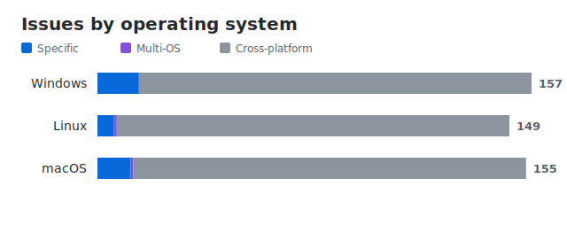

= IDEasy Quality Status
:toc: left
:toclevels: 3
:icons: font
:source-highlighter: rouge
:nofooter:

== Overview

Automatically generated open issue overview for
https://github.com/devonfw/IDEasy[devonfw/IDEasy].

### Issue Statistics

#### Assignment

#### Issue Types

_Generated: 2026-06-19 12:08 UTC_

== Operating System Status Files

Issues are assigned to operating systems based on their labels:
`windows`, `linux`, or `macOS`.

Issues without an operating system label are treated as cross-platform.
*A total of 134 cross-platform issues* are documented centrally in this document and are therefore not repeated in the operating system specific files.

The detailed tool status is split into one generated file per operating system.

Status files: link:quality-status-windows.adoc[Windows] | link:quality-status-linux.adoc[Linux] | link:quality-status-macos.adoc[macOS]

== Quality Insights

=== Issue Age Distribution

Cross-platform issues by age: <<cross-platform-0-10-days,0-10 days>> | <<cross-platform-11-30-days,11-30 days>> | <<cross-platform-31-60-days,31-60 days>> | <<cross-platform-61-90-days,61-90 days>> | <<cross-platform-90plus-days,90+ days>>

=== Most common functional labels

Top GitHub labels based on number of issues. This statistic excludes generic labels such as bug/task/enhancement, operating-system labels, and workflow or maintenance labels (for example documentation, dependencies, or help wanted).

== Cross-platform Issues

[%header, cols="^1,7"]
|===
| Issue | Summary
2+^a| [[cross-platform-0-10-days]] *0-10 days*

| link:https://github.com/devonfw/IDEasy/issues/2052[#2052]
| Split issue statistics into separate assigned and unassigned pie charts

| link:https://github.com/devonfw/IDEasy/issues/2051[#2051]
| Release workflow failing publishing release metadata on github

| link:https://github.com/devonfw/IDEasy/issues/2050[#2050]
| Evaluate shim/launcher-based runtime activation for Node/npm in IDEasy (follow-…

| link:https://github.com/devonfw/IDEasy/issues/2045[#2045]
| Add tool selection and version/edition configuration via GUI

| link:https://github.com/devonfw/IDEasy/issues/2044[#2044]
| mvn --<TAB> does not trigger completion

| link:https://github.com/devonfw/IDEasy/issues/2042[#2042]
| -q parameter supresses ask for CVE choices

| link:https://github.com/devonfw/IDEasy/issues/2040[#2040]
| Workspace selection buggy

| link:https://github.com/devonfw/IDEasy/issues/2039[#2039]
| IDE logo not shown in mac task bar

| link:https://github.com/devonfw/IDEasy/issues/2033[#2033]
| Improve documentation of GUI code.

| link:https://github.com/devonfw/IDEasy/issues/2026[#2026]
| Create UvRepository and UvBasedCommandlet

| link:https://github.com/devonfw/IDEasy/issues/2025[#2025]
| Improve JavaDoc of IdeContext

| link:https://github.com/devonfw/IDEasy/issues/2021[#2021]
| Remove status.json from ide-urls after migration

| link:https://github.com/devonfw/IDEasy/issues/2013[#2013]
| Warning: "Unsupported JavaFX configuration: classes were loaded from 'unnamed m…

2+^a| [[cross-platform-11-30-days]] *11-30 days*

| link:https://github.com/devonfw/IDEasy/issues/2000[#2000]
| Create script for local end-to-end testing

| link:https://github.com/devonfw/IDEasy/issues/1996[#1996]
| Revisit design for tools that do not install to software repository

| link:https://github.com/devonfw/IDEasy/issues/1992[#1992]
| Improve GitContextMock

| link:https://github.com/devonfw/IDEasy/issues/1990[#1990]
| Merge of Vscode settings.json file fails

| link:https://github.com/devonfw/IDEasy/issues/1987[#1987]
| Gui commandlet broken for snapshots

| link:https://github.com/devonfw/IDEasy/issues/1976[#1976]
| Extend ToolCommandlet installation logic to allow software-repository-only inst…

| link:https://github.com/devonfw/IDEasy/issues/1975[#1975]
| Improve state management implementation in the GUI

| link:https://github.com/devonfw/IDEasy/issues/1965[#1965]
| Improve dependent installations

2+^a| [[cross-platform-31-60-days]] *31-60 days*

| link:https://github.com/devonfw/IDEasy/issues/1953[#1953]
| Implement Base Functionality of Cleanup Commandlet

| link:https://github.com/devonfw/IDEasy/issues/1943[#1943]
| Create Ruby Commandlet

| link:https://github.com/devonfw/IDEasy/issues/1942[#1942]
| Create a RubyUrlUpdater

| link:https://github.com/devonfw/IDEasy/issues/1938[#1938]
| GUI not launchable outside of project context

| link:https://github.com/devonfw/IDEasy/issues/1937[#1937]
| Ability to link content from settings into workspace(s)

| link:https://github.com/devonfw/IDEasy/issues/1936[#1936]
| Improve localization of the GUI

| link:https://github.com/devonfw/IDEasy/issues/1933[#1933]
| Implement a console window in the GUI

| link:https://github.com/devonfw/IDEasy/issues/1930[#1930]
| Implemenent a tag-based filtering system into the GUI

| link:https://github.com/devonfw/IDEasy/issues/1929[#1929]
| Manage tool installations via the GUI

| link:https://github.com/devonfw/IDEasy/issues/1928[#1928]
| Show user pro-active notifications of updates in the GUI

| link:https://github.com/devonfw/IDEasy/issues/1927[#1927]
| IDEasy virtual instance for AI agent

| link:https://github.com/devonfw/IDEasy/issues/1917[#1917]
| Allow the creation of a desktop shortcut for the GUI

| link:https://github.com/devonfw/IDEasy/issues/1909[#1909]
| Support for maven daemon (mvnd)

| link:https://github.com/devonfw/IDEasy/issues/1902[#1902]
| Create InsoUrlUpdater

| link:https://github.com/devonfw/IDEasy/issues/1868[#1868]
| Revision of the functionality of global tool commandlets

2+^a| [[cross-platform-61-90-days]] *61-90 days*

| link:https://github.com/devonfw/IDEasy/issues/1814[#1814]
| IDEasy still reports updates for settings are available after any number of inv…

| link:https://github.com/devonfw/IDEasy/issues/1808[#1808]
| icd is not navigating into single available workspace on icd -p project

| link:https://github.com/devonfw/IDEasy/issues/1787[#1787]
| tracking yarn versions broken

| link:https://github.com/devonfw/IDEasy/issues/1785[#1785]
| Implemenent confirmation modals using JavaFX

| link:https://github.com/devonfw/IDEasy/issues/1784[#1784]
| Implement JavaFX based progress bars for the GUI

2+^a| [[cross-platform-90plus-days]] *90+ days*

| link:https://github.com/devonfw/IDEasy/issues/1746[#1746]
| ide shell broken

| link:https://github.com/devonfw/IDEasy/issues/1721[#1721]
| Integrate ruby

| link:https://github.com/devonfw/IDEasy/issues/1720[#1720]
| Integrate SoapUI

| link:https://github.com/devonfw/IDEasy/issues/1695[#1695]
| Clone settings to temporary directory, analyse, and then move

| link:https://github.com/devonfw/IDEasy/issues/1694[#1694]
| Fix behavior when providing a wrong git URL

| link:https://github.com/devonfw/IDEasy/issues/1689[#1689]
| Fix user commnication when switching the Java version from the default to the r…

| link:https://github.com/devonfw/IDEasy/issues/1676[#1676]
| Import extra SDKs automatically into IDE

| link:https://github.com/devonfw/IDEasy/issues/1659[#1659]
| Global tools run tool while installation is running in background

| link:https://github.com/devonfw/IDEasy/issues/1651[#1651]
| Move status.json files out of ide-urls to own repo

| link:https://github.com/devonfw/IDEasy/issues/1634[#1634]
| UrlUpdater creates error entries for HTTP status 200

| link:https://github.com/devonfw/IDEasy/issues/1628[#1628]
| Support for OS specific CVEs

| link:https://github.com/devonfw/IDEasy/issues/1594[#1594]
| implement ReleaseCommandlet

| link:https://github.com/devonfw/IDEasy/issues/1580[#1580]
| Implement cleanup

| link:https://github.com/devonfw/IDEasy/issues/1525[#1525]
| lombok not correctly installed in eclipse

| link:https://github.com/devonfw/IDEasy/issues/1517[#1517]
| IDEasy setup does not install Windows Terminal

| link:https://github.com/devonfw/IDEasy/issues/1501[#1501]
| Starting intellij leads to error popup

| link:https://github.com/devonfw/IDEasy/issues/1493[#1493]
| Analyze Scoop Windows CLI installer

| link:https://github.com/devonfw/IDEasy/issues/1453[#1453]
| Allow co-authored commits in cla assistant

| link:https://github.com/devonfw/IDEasy/issues/1422[#1422]
| Refactor tests to remove windowsJunctionsAreUsed

| link:https://github.com/devonfw/IDEasy/issues/1333[#1333]
| Step 'Install or update software' already ended with false and now ended again…

| link:https://github.com/devonfw/IDEasy/issues/1311[#1311]
| improve IDE_MIN_VERSION support

| link:https://github.com/devonfw/IDEasy/issues/1296[#1296]
| Implement IdeContext properly for Dashboard

| link:https://github.com/devonfw/IDEasy/issues/1295[#1295]
| IDEasy Dashboard Epic

| link:https://github.com/devonfw/IDEasy/issues/1263[#1263]
| Fix android-studio workspace templates

| link:https://github.com/devonfw/IDEasy/issues/1225[#1225]
| Create new IDEasy introduction videos

| link:https://github.com/devonfw/IDEasy/issues/1216[#1216]
| Release workflow should only deploy artifacts after all tests passed

| link:https://github.com/devonfw/IDEasy/issues/1215[#1215]
| nightly build not executing tests anymore

| link:https://github.com/devonfw/IDEasy/issues/1214[#1214]
| preserve EOL style in upgrade-settings

| link:https://github.com/devonfw/IDEasy/issues/1209[#1209]
| migration version message is confusing

| link:https://github.com/devonfw/IDEasy/issues/1206[#1206]
| java.util.zip.ZipException when opening Android Studio archives from versions 2…

| link:https://github.com/devonfw/IDEasy/issues/1181[#1181]
| Improve url updater for docker desktop to pull all necessary versions

| link:https://github.com/devonfw/IDEasy/issues/1178[#1178]
| Revisit VersionPhase detection

| link:https://github.com/devonfw/IDEasy/issues/1167[#1167]
| Automatic project import for VSCode

| link:https://github.com/devonfw/IDEasy/issues/1165[#1165]
| Automatic project import for Eclipse

| link:https://github.com/devonfw/IDEasy/issues/1164[#1164]
| Automatic project import

| link:https://github.com/devonfw/IDEasy/issues/1155[#1155]
| Improve IntelliJ layout

| link:https://github.com/devonfw/IDEasy/issues/1150[#1150]
| Full ARM support

| link:https://github.com/devonfw/IDEasy/issues/1135[#1135]
| IDEasy does not set env variables on Windows PowerShell

| link:https://github.com/devonfw/IDEasy/issues/1134[#1134]
| IDEasy autocompletion gets stuck if license agreement file was not found

| link:https://github.com/devonfw/IDEasy/issues/1124[#1124]
| Ensure latest version of Python is installed

| link:https://github.com/devonfw/IDEasy/issues/1063[#1063]
| User specific configurations are not working as described

| link:https://github.com/devonfw/IDEasy/issues/1059[#1059]
| Improve and fix dependency mechanism

| link:https://github.com/devonfw/IDEasy/issues/1054[#1054]
| Incorrect interpretation of trailling and leading spaces in version range parsi…

| link:https://github.com/devonfw/IDEasy/issues/1041[#1041]
| native image has globbing active

| link:https://github.com/devonfw/IDEasy/issues/1031[#1031]
| Integration of OpenRewrite

| link:https://github.com/devonfw/IDEasy/issues/992[#992]
| Support multiple attributes for merge:id

| link:https://github.com/devonfw/IDEasy/issues/989[#989]
| allow expressions in template variable definitions

| link:https://github.com/devonfw/IDEasy/issues/987[#987]
| conditional templates

| link:https://github.com/devonfw/IDEasy/issues/945[#945]
| Improve ide update with smart dependency handling

| link:https://github.com/devonfw/IDEasy/issues/943[#943]
| XmlMerger: Rework Combine Text Nodes

| link:https://github.com/devonfw/IDEasy/issues/930[#930]
| Refactor `JsonPrettyPrinter` to be usable in CustomToolJson

| link:https://github.com/devonfw/IDEasy/issues/897[#897]
| HTTP Proxy with TLS termination causing errors

| link:https://github.com/devonfw/IDEasy/issues/892[#892]
| Improve GitContextTest tests to actually test something

| link:https://github.com/devonfw/IDEasy/issues/891[#891]
| Improve Url Updater Report Overview

| link:https://github.com/devonfw/IDEasy/issues/882[#882]
| Skip step if no installation was required

| link:https://github.com/devonfw/IDEasy/issues/840[#840]
| git fetch does not work with multiple remotes

| link:https://github.com/devonfw/IDEasy/issues/825[#825]
| Consider adding GC Log Analyzer

| link:https://github.com/devonfw/IDEasy/issues/822[#822]
| Handle long CWD paths in shell prompt

| link:https://github.com/devonfw/IDEasy/issues/821[#821]
| Allow User to remove "ide " prefix in ide shell for non-IDEasy command

| link:https://github.com/devonfw/IDEasy/issues/788[#788]
| Add more starting flags to IDE commandlets

| link:https://github.com/devonfw/IDEasy/issues/787[#787]
| Provide variable to disable open new workspace

| link:https://github.com/devonfw/IDEasy/issues/785[#785]
| Re-introduce workspace reverse options from devonfw-ide

| link:https://github.com/devonfw/IDEasy/issues/780[#780]
| Create IDEasy service

| link:https://github.com/devonfw/IDEasy/issues/772[#772]
| CVE-2023-7272 in org.eclipse.parsson 1.1.7

| link:https://github.com/devonfw/IDEasy/issues/771[#771]
| Check URL Updater issues

| link:https://github.com/devonfw/IDEasy/issues/768[#768]
| Improve IntelliJ configuration (annotation processing, auto-import, maven argLi…

| link:https://github.com/devonfw/IDEasy/issues/756[#756]
| Implement CustomToolRepositoryTest

| link:https://github.com/devonfw/IDEasy/issues/741[#741]
| Add a warning message for legacy devonfw-ide settings users

| link:https://github.com/devonfw/IDEasy/issues/735[#735]
| Enhance workspace configuration with generic overlay from settings/workspace

| link:https://github.com/devonfw/IDEasy/issues/726[#726]
| Replace hardcoded dependencies with dependencies.json in ide-urls

| link:https://github.com/devonfw/IDEasy/issues/714[#714]
| Improve UX for settings repository

| link:https://github.com/devonfw/IDEasy/issues/701[#701]
| Fix Dotnet tests on our CI

| link:https://github.com/devonfw/IDEasy/issues/690[#690]
| UpdateUrls workflow timeout not working

| link:https://github.com/devonfw/IDEasy/issues/639[#639]
| Improve step success logic for sub steps

| link:https://github.com/devonfw/IDEasy/issues/629[#629]
| Recycle devonfw-ide documentation

| link:https://github.com/devonfw/IDEasy/issues/607[#607]
| Test for environment variables of process contexts  

| link:https://github.com/devonfw/IDEasy/issues/516[#516]
| IdeToolCommandlet: add option and support for import of project(s)

| link:https://github.com/devonfw/IDEasy/issues/492[#492]
| Use Maven dependency cache to optimize workflow running times

| link:https://github.com/devonfw/IDEasy/issues/449[#449]
| Consider integration of continue GenAI coding assistant

| link:https://github.com/devonfw/IDEasy/issues/412[#412]
| consider integration of lama

| link:https://github.com/devonfw/IDEasy/issues/399[#399]
| Handle uninstall of global tool commandlets

| link:https://github.com/devonfw/IDEasy/issues/379[#379]
| Rename default branch of repo ide-urls from master to main

| link:https://github.com/devonfw/IDEasy/issues/370[#370]
| Create local github actions for tests

| link:https://github.com/devonfw/IDEasy/issues/218[#218]
| Add possibility to start a command in a new window with the process builder

| link:https://github.com/devonfw/IDEasy/issues/190[#190]
| Improve #103: security warning for CVEs in file tool/edition/security

| link:https://github.com/devonfw/IDEasy/issues/169[#169]
| Check if we want to utilize TailTipWidgets for the autocompleter

| link:https://github.com/devonfw/IDEasy/issues/162[#162]
| Difficulty to find the right spot in the documentation

| link:https://github.com/devonfw/IDEasy/issues/98[#98]
| Ability to secure downloads from custom repository

| link:https://github.com/devonfw/IDEasy/issues/75[#75]
| Consider integration of oracle XE

| link:https://github.com/devonfw/IDEasy/issues/72[#72]
| Add further editions of java

| link:https://github.com/devonfw/IDEasy/issues/45[#45]
| Add compression for native images

| link:https://github.com/devonfw/IDEasy/issues/44[#44]
| DockerUrlUpdater not finding/adding specific versions

| link:https://github.com/devonfw/IDEasy/issues/19[#19]
| Implement ToolCommandlet for Google Cloud CLI

|===

== How to update this document

This document is generated automatically from open GitHub issues in
https://github.com/devonfw/IDEasy[devonfw/IDEasy].
