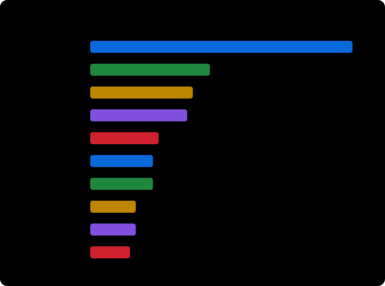

= IDEasy Quality Status
:toc: left
:toclevels: 3
:icons: font
:source-highlighter: rouge
:nofooter:

== Overview

Automatically generated open issue overview for
https://github.com/devonfw/IDEasy[devonfw/IDEasy].

### Issue Statistics

#### Assignment

#### Issue Types

_Generated: 2026-08-17 06:45 UTC_

== Operating System Status Files

Issues are assigned to operating systems based on their labels:
`windows`, `linux`, or `macOS`.

Issues without an operating system label are treated as cross-platform.
*A total of 150 cross-platform issues* are documented centrally in this document and are therefore not repeated in the operating system specific files.

The detailed tool status is split into one generated file per operating system.

Status files: link:quality-status-windows.adoc[Windows] | link:quality-status-linux.adoc[Linux] | link:quality-status-macos.adoc[macOS]

== Quality Insights

=== Issue Age Distribution

Cross-platform issues by age: <<cross-platform-0-10-days,0-10 days>> | <<cross-platform-11-30-days,11-30 days>> | <<cross-platform-31-60-days,31-60 days>> | <<cross-platform-61-90-days,61-90 days>> | <<cross-platform-90plus-days,90+ days>>

=== Most common functional labels

Top GitHub labels based on number of issues. This statistic excludes generic labels such as bug/task/enhancement, operating-system labels, and workflow or maintenance labels (for example documentation, dependencies, or help wanted).

== Cross-platform Issues

[%header, cols="^1,7"]
|===
| Issue | Summary
2+^a| [[cross-platform-0-10-days]] *0-10 days*

| link:https://github.com/devonfw/IDEasy/issues/2336[#2336]
| Reconsider treating idea.properties as a user-configurable workspace template

| link:https://github.com/devonfw/IDEasy/issues/2329[#2329]
| Workspace "main" should be auto-selected when selecting a project in the GUI

| link:https://github.com/devonfw/IDEasy/issues/2327[#2327]
| Gui project setup epic

| link:https://github.com/devonfw/IDEasy/issues/2326[#2326]
| Migrate project loading logic from gui based ProjectManager to cli-based IdeCon…

| link:https://github.com/devonfw/IDEasy/issues/2325[#2325]
| Add checkboxes for "Add to start desktop/taskbar" to MSI installer

| link:https://github.com/devonfw/IDEasy/issues/2322[#2322]
| Align used icons for the GUI

| link:https://github.com/devonfw/IDEasy/issues/2319[#2319]
| 'ide status' should report an unsigned license agreement, not error/hang on it

| link:https://github.com/devonfw/IDEasy/issues/2316[#2316]
| Homebrew formula publish fails: brew audit no longer accepts a path

| link:https://github.com/devonfw/IDEasy/issues/2314[#2314]
| Implement the handling of Steps in the GUI.

| link:https://github.com/devonfw/IDEasy/issues/2313[#2313]
| Python installation fails with wired behaviour

| link:https://github.com/devonfw/IDEasy/issues/2312[#2312]
| Python broken due to error in UvRepository

| link:https://github.com/devonfw/IDEasy/issues/2311[#2311]
| SoapUI not working in projects that do not have java installed

| link:https://github.com/devonfw/IDEasy/issues/2298[#2298]
| Automatically Assign Pull Request Author as Assignee

| link:https://github.com/devonfw/IDEasy/issues/2296[#2296]
| Improve support to get installed version and edition

| link:https://github.com/devonfw/IDEasy/issues/2293[#2293]
| Rework spyder as IdeToolCommandlet

2+^a| [[cross-platform-11-30-days]] *11-30 days*

| link:https://github.com/devonfw/IDEasy/issues/2286[#2286]
| SystemPath.findBinary ignores extraPathEntries, so withPathEntry has no effect…

| link:https://github.com/devonfw/IDEasy/issues/2284[#2284]
| Restore .ide.software.version from actual installed Python version

| link:https://github.com/devonfw/IDEasy/issues/2283[#2283]
| GUI blocks commandlets when license agreement is missing

| link:https://github.com/devonfw/IDEasy/issues/2281[#2281]
| Allow removing plugins from the IDEasy GUI

| link:https://github.com/devonfw/IDEasy/issues/2280[#2280]
| Maven commandlet runs from workspace root instead of project directory

| link:https://github.com/devonfw/IDEasy/issues/2279[#2279]
| Desktop shortcut for the GUI does not work: gui commandlet requires IDE_HOME

| link:https://github.com/devonfw/IDEasy/issues/2278[#2278]
| Restructure main-view.fxml into seperate layout files

| link:https://github.com/devonfw/IDEasy/issues/2277[#2277]
| Research task: Check if JavaFX Platform.runLater() method correctly logs thrown…

| link:https://github.com/devonfw/IDEasy/issues/2275[#2275]
| Auto-install git if not already installed

| link:https://github.com/devonfw/IDEasy/issues/2274[#2274]
| Create GitUrlUpdater

| link:https://github.com/devonfw/IDEasy/issues/2273[#2273]
| Integrate git as global tool

| link:https://github.com/devonfw/IDEasy/issues/2269[#2269]
| Allow choice of installation location in macOS PKG Installer

| link:https://github.com/devonfw/IDEasy/issues/2268[#2268]
| Allow text selection in console

| link:https://github.com/devonfw/IDEasy/issues/2267[#2267]
| Allow multi selection in console list view (or for ListViews in general)

| link:https://github.com/devonfw/IDEasy/issues/2265[#2265]
| MainView status progress bar not displaying correctly when indeterminate

| link:https://github.com/devonfw/IDEasy/issues/2257[#2257]
| Refactor CI/CD Workflows and Improve Release Documentation

| link:https://github.com/devonfw/IDEasy/issues/2256[#2256]
| Integrate SonarCloud analysis into GitHub workflows

| link:https://github.com/devonfw/IDEasy/issues/2255[#2255]
| Refactor build logic from GitHub Workflows into dedicated shell scripts

| link:https://github.com/devonfw/IDEasy/issues/2253[#2253]
| Improve/fix documentation of structure and logs

| link:https://github.com/devonfw/IDEasy/issues/2248[#2248]
| Change TaskManager design.

| link:https://github.com/devonfw/IDEasy/issues/2241[#2241]
| Version selection support

| link:https://github.com/devonfw/IDEasy/issues/2240[#2240]
| Support file and folder selection

| link:https://github.com/devonfw/IDEasy/issues/2236[#2236]
| Preserve Git Bash Working Directory When Launching VS Code via ide vscode

| link:https://github.com/devonfw/IDEasy/issues/2225[#2225]
| Define installation ownership for Homebrew: brew and 'ideasy install' produce a…

| link:https://github.com/devonfw/IDEasy/issues/2219[#2219]
| Add unpack commandlet

| link:https://github.com/devonfw/IDEasy/issues/2214[#2214]
| Overhaul language selection logic

| link:https://github.com/devonfw/IDEasy/issues/2200[#2200]
| Add repository linting support

| link:https://github.com/devonfw/IDEasy/issues/2193[#2193]
| Support for conditional auto-completion

| link:https://github.com/devonfw/IDEasy/issues/2191[#2191]
| Improve auto-completion

| link:https://github.com/devonfw/IDEasy/issues/2190[#2190]
| IDEasy destroys my python installation

| link:https://github.com/devonfw/IDEasy/issues/2186[#2186]
| Create ObsidianUrlUpdater

| link:https://github.com/devonfw/IDEasy/issues/2185[#2185]
| Explore JPackage and evaluate

| link:https://github.com/devonfw/IDEasy/issues/2183[#2183]
| Dynamically generate form fields for selected commandlet

| link:https://github.com/devonfw/IDEasy/issues/2182[#2182]
| Basic structure for Commandlet view

| link:https://github.com/devonfw/IDEasy/issues/2180[#2180]
| Add *_EXTRA_PLUGINS variable to install extra IDE plugins per user

| link:https://github.com/devonfw/IDEasy/issues/2178[#2178]
| Make ReleaseCommandlet independent of specific build commandlet

| link:https://github.com/devonfw/IDEasy/issues/2174[#2174]
| VSCode: store metadata under $IDE_HOME/.ide/vscode/<workspace> + migration

| link:https://github.com/devonfw/IDEasy/issues/2173[#2173]
| JetBrains: store IntelliJ/PyCharm/Android Studio metadata under $IDE_HOME/.ide…

2+^a| [[cross-platform-31-60-days]] *31-60 days*

| link:https://github.com/devonfw/IDEasy/issues/2168[#2168]
| repository remote feature

| link:https://github.com/devonfw/IDEasy/issues/2165[#2165]
| prompt user for template variables at apply time

| link:https://github.com/devonfw/IDEasy/issues/2142[#2142]
| Move IDE-specific metada (.idea, .vscode) out of workspace

| link:https://github.com/devonfw/IDEasy/issues/2124[#2124]
| Workflow "Update Quality Status Documents" Fails

| link:https://github.com/devonfw/IDEasy/issues/2111[#2111]
| Add user documentation for GUI

| link:https://github.com/devonfw/IDEasy/issues/2110[#2110]
| Add documentation for contributing to UI components

| link:https://github.com/devonfw/IDEasy/issues/2109[#2109]
| Add documentation on how to modify the FIGMA board properly

| link:https://github.com/devonfw/IDEasy/issues/2108[#2108]
| Modify PR Template for GUI contributions.

| link:https://github.com/devonfw/IDEasy/issues/2107[#2107]
| Add documentation for contributing to the GUI

| link:https://github.com/devonfw/IDEasy/issues/2103[#2103]
| Add obsidian software/commandlet

| link:https://github.com/devonfw/IDEasy/issues/2097[#2097]
| Configure IDE Plugins in Tool Configuration Tree in the GUI

| link:https://github.com/devonfw/IDEasy/issues/2096[#2096]
| Add a commandlet execution user interface

| link:https://github.com/devonfw/IDEasy/issues/2058[#2058]
| VSCode authentication not working with IDEasy

| link:https://github.com/devonfw/IDEasy/issues/2050[#2050]
| Evaluate shim/launcher-based runtime activation for Node/npm in IDEasy (follow-…

| link:https://github.com/devonfw/IDEasy/issues/2045[#2045]
| Add tool selection and version/edition configuration via GUI

2+^a| [[cross-platform-61-90-days]] *61-90 days*

| link:https://github.com/devonfw/IDEasy/issues/2040[#2040]
| Workspace selection buggy

| link:https://github.com/devonfw/IDEasy/issues/2021[#2021]
| Remove status.json from ide-urls after migration

| link:https://github.com/devonfw/IDEasy/issues/1996[#1996]
| Revisit design for tools that do not install to software repository

| link:https://github.com/devonfw/IDEasy/issues/1975[#1975]
| Improve state management implementation in the GUI

| link:https://github.com/devonfw/IDEasy/issues/1965[#1965]
| Improve dependent installations

2+^a| [[cross-platform-90plus-days]] *90+ days*

| link:https://github.com/devonfw/IDEasy/issues/1943[#1943]
| Create Ruby Commandlet

| link:https://github.com/devonfw/IDEasy/issues/1933[#1933]
| Implement a console window in the GUI

| link:https://github.com/devonfw/IDEasy/issues/1930[#1930]
| Implemenent a tag-based filtering system into the GUI

| link:https://github.com/devonfw/IDEasy/issues/1929[#1929]
| Manage tool installations via the GUI

| link:https://github.com/devonfw/IDEasy/issues/1928[#1928]
| Show user pro-active notifications of updates in the GUI

| link:https://github.com/devonfw/IDEasy/issues/1927[#1927]
| IDEasy virtual instance for AI agent

| link:https://github.com/devonfw/IDEasy/issues/1868[#1868]
| Revision of the functionality of global tool commandlets

| link:https://github.com/devonfw/IDEasy/issues/1808[#1808]
| icd is not navigating into single available workspace on icd -p project

| link:https://github.com/devonfw/IDEasy/issues/1787[#1787]
| tracking yarn versions broken

| link:https://github.com/devonfw/IDEasy/issues/1785[#1785]
| Implemenent confirmation modals using JavaFX

| link:https://github.com/devonfw/IDEasy/issues/1746[#1746]
| ide shell broken

| link:https://github.com/devonfw/IDEasy/issues/1721[#1721]
| Integrate ruby

| link:https://github.com/devonfw/IDEasy/issues/1695[#1695]
| Clone settings to temporary directory, analyse, and then move

| link:https://github.com/devonfw/IDEasy/issues/1676[#1676]
| Import extra SDKs automatically into IDE

| link:https://github.com/devonfw/IDEasy/issues/1651[#1651]
| Move status.json files out of ide-urls to own repo

| link:https://github.com/devonfw/IDEasy/issues/1634[#1634]
| UrlUpdater creates error entries for HTTP status 200

| link:https://github.com/devonfw/IDEasy/issues/1628[#1628]
| Support for OS specific CVEs

| link:https://github.com/devonfw/IDEasy/issues/1580[#1580]
| Implement cleanup

| link:https://github.com/devonfw/IDEasy/issues/1525[#1525]
| lombok not correctly installed in eclipse

| link:https://github.com/devonfw/IDEasy/issues/1493[#1493]
| Analyze Scoop Windows CLI installer

| link:https://github.com/devonfw/IDEasy/issues/1453[#1453]
| Allow co-authored commits in cla assistant

| link:https://github.com/devonfw/IDEasy/issues/1333[#1333]
| Step 'Install or update software' already ended with false and now ended again…

| link:https://github.com/devonfw/IDEasy/issues/1296[#1296]
| Implement IdeContext properly for Dashboard

| link:https://github.com/devonfw/IDEasy/issues/1295[#1295]
| IDEasy Dashboard Epic

| link:https://github.com/devonfw/IDEasy/issues/1225[#1225]
| Create new IDEasy introduction videos

| link:https://github.com/devonfw/IDEasy/issues/1216[#1216]
| Release workflow should only deploy artifacts after all tests passed

| link:https://github.com/devonfw/IDEasy/issues/1215[#1215]
| nightly build not executing tests anymore

| link:https://github.com/devonfw/IDEasy/issues/1214[#1214]
| preserve EOL style in upgrade-settings

| link:https://github.com/devonfw/IDEasy/issues/1209[#1209]
| migration version message is confusing

| link:https://github.com/devonfw/IDEasy/issues/1181[#1181]
| Improve url updater for docker desktop to pull all necessary versions

| link:https://github.com/devonfw/IDEasy/issues/1167[#1167]
| Automatic project import for VSCode

| link:https://github.com/devonfw/IDEasy/issues/1165[#1165]
| Automatic project import for Eclipse

| link:https://github.com/devonfw/IDEasy/issues/1164[#1164]
| Automatic project import

| link:https://github.com/devonfw/IDEasy/issues/1155[#1155]
| Improve IntelliJ layout

| link:https://github.com/devonfw/IDEasy/issues/1150[#1150]
| Full ARM support

| link:https://github.com/devonfw/IDEasy/issues/1135[#1135]
| IDEasy does not set env variables on Windows PowerShell

| link:https://github.com/devonfw/IDEasy/issues/1134[#1134]
| IDEasy autocompletion gets stuck if license agreement file was not found

| link:https://github.com/devonfw/IDEasy/issues/1059[#1059]
| Improve and fix dependency mechanism

| link:https://github.com/devonfw/IDEasy/issues/1054[#1054]
| Incorrect interpretation of trailling and leading spaces in version range parsi…

| link:https://github.com/devonfw/IDEasy/issues/1031[#1031]
| Integration of OpenRewrite

| link:https://github.com/devonfw/IDEasy/issues/992[#992]
| Support multiple attributes for merge:id

| link:https://github.com/devonfw/IDEasy/issues/989[#989]
| allow expressions in template variable definitions

| link:https://github.com/devonfw/IDEasy/issues/987[#987]
| conditional templates

| link:https://github.com/devonfw/IDEasy/issues/945[#945]
| Improve ide update with smart dependency handling

| link:https://github.com/devonfw/IDEasy/issues/943[#943]
| XmlMerger: Rework Combine Text Nodes

| link:https://github.com/devonfw/IDEasy/issues/930[#930]
| Refactor `JsonPrettyPrinter` to be usable in CustomToolJson

| link:https://github.com/devonfw/IDEasy/issues/892[#892]
| Improve GitContextTest tests to actually test something

| link:https://github.com/devonfw/IDEasy/issues/891[#891]
| Improve Url Updater Report Overview

| link:https://github.com/devonfw/IDEasy/issues/882[#882]
| Skip step if no installation was required

| link:https://github.com/devonfw/IDEasy/issues/840[#840]
| git fetch does not work with multiple remotes

| link:https://github.com/devonfw/IDEasy/issues/821[#821]
| Allow User to remove "ide " prefix in ide shell for non-IDEasy command

| link:https://github.com/devonfw/IDEasy/issues/788[#788]
| Add more starting flags to IDE commandlets

| link:https://github.com/devonfw/IDEasy/issues/787[#787]
| Provide variable to disable open new workspace

| link:https://github.com/devonfw/IDEasy/issues/785[#785]
| Re-introduce workspace reverse options from devonfw-ide

| link:https://github.com/devonfw/IDEasy/issues/780[#780]
| Create IDEasy service

| link:https://github.com/devonfw/IDEasy/issues/771[#771]
| Check URL Updater issues

| link:https://github.com/devonfw/IDEasy/issues/741[#741]
| Add a warning message for legacy devonfw-ide settings users

| link:https://github.com/devonfw/IDEasy/issues/726[#726]
| Replace hardcoded dependencies with dependencies.json in ide-urls

| link:https://github.com/devonfw/IDEasy/issues/714[#714]
| Improve UX for settings repository

| link:https://github.com/devonfw/IDEasy/issues/690[#690]
| UpdateUrls workflow timeout not working

| link:https://github.com/devonfw/IDEasy/issues/629[#629]
| Recycle devonfw-ide documentation

| link:https://github.com/devonfw/IDEasy/issues/607[#607]
| Test for environment variables of process contexts  

| link:https://github.com/devonfw/IDEasy/issues/492[#492]
| Use Maven dependency cache to optimize workflow running times

| link:https://github.com/devonfw/IDEasy/issues/449[#449]
| Consider integration of continue GenAI coding assistant

| link:https://github.com/devonfw/IDEasy/issues/399[#399]
| Handle uninstall of global tool commandlets

| link:https://github.com/devonfw/IDEasy/issues/379[#379]
| Rename default branch of repo ide-urls from master to main

| link:https://github.com/devonfw/IDEasy/issues/370[#370]
| Create local github actions for tests

| link:https://github.com/devonfw/IDEasy/issues/218[#218]
| Add possibility to start a command in a new window with the process builder

| link:https://github.com/devonfw/IDEasy/issues/190[#190]
| Improve #103: security warning for CVEs in file tool/edition/security

| link:https://github.com/devonfw/IDEasy/issues/169[#169]
| Check if we want to utilize TailTipWidgets for the autocompleter

| link:https://github.com/devonfw/IDEasy/issues/162[#162]
| Difficulty to find the right spot in the documentation

| link:https://github.com/devonfw/IDEasy/issues/98[#98]
| Ability to secure downloads from custom repository

| link:https://github.com/devonfw/IDEasy/issues/75[#75]
| Consider integration of oracle XE

| link:https://github.com/devonfw/IDEasy/issues/72[#72]
| Add further editions of java

| link:https://github.com/devonfw/IDEasy/issues/45[#45]
| Add compression for native images

| link:https://github.com/devonfw/IDEasy/issues/44[#44]
| DockerUrlUpdater not finding/adding specific versions

| link:https://github.com/devonfw/IDEasy/issues/19[#19]
| Implement ToolCommandlet for Google Cloud CLI

|===

== How to update this document

This document is generated automatically from open GitHub issues in
https://github.com/devonfw/IDEasy[devonfw/IDEasy].
