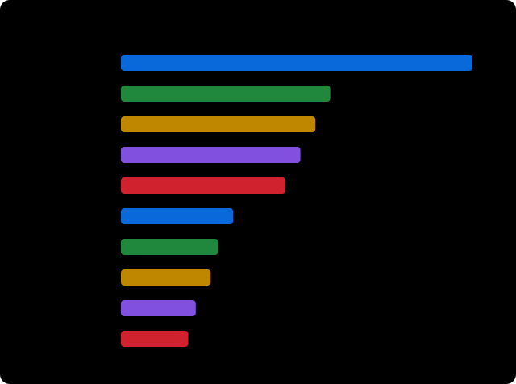

= IDEasy Quality Status
:toc: left
:toclevels: 3
:icons: font
:source-highlighter: rouge
:nofooter:

== Overview

Automatically generated open issue overview for
https://github.com/devonfw/IDEasy[devonfw/IDEasy].

### Issue Statistics

#### Assignment

#### Issue Types

_Generated: 2026-10-05 13:19 UTC_

== Operating System Status Files

Issues are assigned to operating systems based on their labels:
`windows`, `linux`, or `macOS`.

Issues without an operating system label are treated as cross-platform.
*A total of 202 cross-platform issues* are documented centrally in this document and are therefore not repeated in the operating system specific files.

The detailed tool status is split into one generated file per operating system.

Status files: link:quality-status-windows.adoc[Windows] | link:quality-status-linux.adoc[Linux] | link:quality-status-macos.adoc[macOS]

== Quality Insights

=== Issue Age Distribution

Cross-platform issues by age: <<cross-platform-0-10-days,0-10 days>> | <<cross-platform-11-30-days,11-30 days>> | <<cross-platform-31-60-days,31-60 days>> | <<cross-platform-61-90-days,61-90 days>> | <<cross-platform-90plus-days,90+ days>>

=== Most common functional labels

Top GitHub labels based on number of issues. This statistic excludes generic labels such as bug/task/enhancement, operating-system labels, and workflow or maintenance labels (for example documentation, dependencies, or help wanted).

== Cross-platform Issues

[%header, cols="^1,7"]
|===
| Issue | Summary
2+^a| [[cross-platform-0-10-days]] *0-10 days*

| link:https://github.com/devonfw/IDEasy/issues/2614[#2614]
| Add ScalaCliUrlUpdater for scala-cli

| link:https://github.com/devonfw/IDEasy/issues/2606[#2606]
| Cleanup documentation (remove updates, include missing guides)

| link:https://github.com/devonfw/IDEasy/issues/2603[#2603]
| Split commandlet-and-url-updater.adoc in 2 separate documentations

| link:https://github.com/devonfw/IDEasy/issues/2600[#2600]
| Use the device code flow for the GitHub login in VSCode to avoid vscode:// call…

| link:https://github.com/devonfw/IDEasy/issues/2599[#2599]
| Nightly integration tests run in parallel with the nightly build and test the p…

| link:https://github.com/devonfw/IDEasy/issues/2598[#2598]
| CI build workflow is skipped

| link:https://github.com/devonfw/IDEasy/issues/2596[#2596]
| NPM-based tools execution and uninstalling broke on Windows

| link:https://github.com/devonfw/IDEasy/issues/2591[#2591]
| Share agent skills in the repository and close gaps in AGENTS.md

| link:https://github.com/devonfw/IDEasy/issues/2589[#2589]
| Cleanup GUI context injection for NlsService

| link:https://github.com/devonfw/IDEasy/issues/2588[#2588]
| Gui commandlet manipulates the global SystemPath instead of the process environ…

| link:https://github.com/devonfw/IDEasy/issues/2585[#2585]
| Create NpmBaseCommandlet for gemini-cli

| link:https://github.com/devonfw/IDEasy/issues/2583[#2583]
| Extract shared commandlet API into interface

| link:https://github.com/devonfw/IDEasy/issues/2582[#2582]
| Use one VSCode user-data-dir per project instead of per workspace

| link:https://github.com/devonfw/IDEasy/issues/2581[#2581]
| VSCode GitHub login is deleted on Windows whenever another VSCode instance star…

| link:https://github.com/devonfw/IDEasy/issues/2579[#2579]
| Maven references settings-security.xml via -Dsettings.security before the file…

| link:https://github.com/devonfw/IDEasy/issues/2573[#2573]
| Implement: Docker Sandbox for AI Coding Agents (implementation of #2419)

| link:https://github.com/devonfw/IDEasy/issues/2572[#2572]
| Make VSCODE_PROFILE_ENABLED ready to be enabled by default

| link:https://github.com/devonfw/IDEasy/issues/2571[#2571]
| ide vscode fails and leaves plugins that are never reinstalled when VSCode is u…

| link:https://github.com/devonfw/IDEasy/issues/2570[#2570]
| VSCode login callbacks (vscode://) do not reach the IDEasy window when another…

| link:https://github.com/devonfw/IDEasy/issues/2569[#2569]
| VSCode plugins installed with VSCODE_PROFILE_ENABLED are missing after the togg…

| link:https://github.com/devonfw/IDEasy/issues/2568[#2568]
| VSCode user settings from the settings repository are ignored when VSCODE_PROFI…

| link:https://github.com/devonfw/IDEasy/issues/2567[#2567]
| Deduplicate logo assets copied to gui and cli

| link:https://github.com/devonfw/IDEasy/issues/2561[#2561]
| python in pristine software repo with per-project isolation

| link:https://github.com/devonfw/IDEasy/issues/2559[#2559]
| Homebrew formula publish fails:  Error: No available formula with the name "ide…

2+^a| [[cross-platform-11-30-days]] *11-30 days*

| link:https://github.com/devonfw/IDEasy/issues/2553[#2553]
| Add release support for yarn

| link:https://github.com/devonfw/IDEasy/issues/2552[#2552]
| Add release support for npm

| link:https://github.com/devonfw/IDEasy/issues/2551[#2551]
| Add release support for Gradle

| link:https://github.com/devonfw/IDEasy/issues/2550[#2550]
| Add release support for remaining build tools

| link:https://github.com/devonfw/IDEasy/issues/2549[#2549]
| Improvement of testing instructions in `contribution.adoc`

| link:https://github.com/devonfw/IDEasy/issues/2547[#2547]
| Figma design for pro-active notifications of updates in the GUI

| link:https://github.com/devonfw/IDEasy/issues/2546[#2546]
| Include repository into git warning/errors

| link:https://github.com/devonfw/IDEasy/issues/2545[#2545]
| Workspace configured twice

| link:https://github.com/devonfw/IDEasy/issues/2544[#2544]
| Native package manager commands inherit IDEasy tool environment

| link:https://github.com/devonfw/IDEasy/issues/2541[#2541]
| Testing inverseMerge fails

| link:https://github.com/devonfw/IDEasy/issues/2538[#2538]
| Test the bugreport commandlet

| link:https://github.com/devonfw/IDEasy/issues/2537[#2537]
| Enhace ide upgrade-settings to remove plugin_ legacy prefix

| link:https://github.com/devonfw/IDEasy/issues/2536[#2536]
| Remove plugin_ prefixes from plugin properties

| link:https://github.com/devonfw/IDEasy/issues/2535[#2535]
| Cleanup ide-settings

| link:https://github.com/devonfw/IDEasy/issues/2531[#2531]
| JetBreains: store metadata (.intellij) out of workspace

| link:https://github.com/devonfw/IDEasy/issues/2530[#2530]
| GitContext.fetch should fetch all remotes if none is specified

| link:https://github.com/devonfw/IDEasy/issues/2528[#2528]
| Simplify GitContext test infrastructure by consolidating mocks

| link:https://github.com/devonfw/IDEasy/issues/2527[#2527]
| Cleanup of IDEasy title not properly shown on macOS

| link:https://github.com/devonfw/IDEasy/issues/2521[#2521]
| Add commandlet for Scala CLI (`scala-cli`)

| link:https://github.com/devonfw/IDEasy/issues/2520[#2520]
| Add commandlet for Dart SDK (`dart`)

| link:https://github.com/devonfw/IDEasy/issues/2519[#2519]
| Add commandlet for Flutter (`flutter`)

| link:https://github.com/devonfw/IDEasy/issues/2518[#2518]
| Add commandlet for Snyk CLI (`snyk`)

| link:https://github.com/devonfw/IDEasy/issues/2517[#2517]
| Add commandlet for jq (`jq`)

| link:https://github.com/devonfw/IDEasy/issues/2516[#2516]
| Add commandlet for pnpm (`pnpm`)

| link:https://github.com/devonfw/IDEasy/issues/2515[#2515]
| Add commandlet for KubeLinter (`kube-linter`)

| link:https://github.com/devonfw/IDEasy/issues/2514[#2514]
| Add commandlet for Ollama CLI (`ollama`)

| link:https://github.com/devonfw/IDEasy/issues/2513[#2513]
| Add commandlet for Ansible (`ansible` / `ansible-playbook`)

| link:https://github.com/devonfw/IDEasy/issues/2512[#2512]
| Add commandlet for Pandoc (`pandoc`)

| link:https://github.com/devonfw/IDEasy/issues/2511[#2511]
| Add commandlet for Helidon CLI (`helidon`)

| link:https://github.com/devonfw/IDEasy/issues/2510[#2510]
| Add commandlet for Micronaut CLI (`mn`)

| link:https://github.com/devonfw/IDEasy/issues/2504[#2504]
| VSCode plugins cannot be reinstalled after the plugins folder was reset when VS…

| link:https://github.com/devonfw/IDEasy/issues/2502[#2502]
| Replace global IdeStartContext lookup with ScopedValue

| link:https://github.com/devonfw/IDEasy/issues/2495[#2495]
| Help text and documentation for the --project flag

| link:https://github.com/devonfw/IDEasy/issues/2494[#2494]
| Retarget IDEA_PROPERTIES to the opened folder (two-phase wiring)

| link:https://github.com/devonfw/IDEasy/issues/2493[#2493]
| Skip workspace configuration (merge + extra-SDK sync) for external launch paths

| link:https://github.com/devonfw/IDEasy/issues/2492[#2492]
| Open the folder given by getOpenPath() in IntelliJ/VS Code launch args

| link:https://github.com/devonfw/IDEasy/issues/2491[#2491]
| Add --project flag with path resolution/validation and getOpenPath() foundation

| link:https://github.com/devonfw/IDEasy/issues/2486[#2486]
| Show little hint on greyed-out IDE start buttons

| link:https://github.com/devonfw/IDEasy/issues/2485[#2485]
| Improve styling of tabs

| link:https://github.com/devonfw/IDEasy/issues/2484[#2484]
| Tab Completion for `ide install python <version>` triggers uv installation/upda…

| link:https://github.com/devonfw/IDEasy/issues/2483[#2483]
| Enable status sync between GUI Roadmap board and Project board

| link:https://github.com/devonfw/IDEasy/issues/2482[#2482]
| Improve CSS styling implementation of the UI

| link:https://github.com/devonfw/IDEasy/issues/2480[#2480]
| Rework Gui Tests

| link:https://github.com/devonfw/IDEasy/issues/2478[#2478]
| Move variable resolution out of RepositoryProperties into the transformation to…

| link:https://github.com/devonfw/IDEasy/issues/2471[#2471]
| VSCode plugin installation fails with "Profile '<name>' not found" when VSCODE_…

| link:https://github.com/devonfw/IDEasy/issues/2470[#2470]
| Create a client service PoC for reading URL metadata

| link:https://github.com/devonfw/IDEasy/issues/2466[#2466]
| ide uninstall should also remove broken link

| link:https://github.com/devonfw/IDEasy/issues/2463[#2463]
| Add unit tests for `ToolCommandlet`

| link:https://github.com/devonfw/IDEasy/issues/2462[#2462]
| Create UrlUpdater for codex

| link:https://github.com/devonfw/IDEasy/issues/2461[#2461]
| Consider integration of codex

| link:https://github.com/devonfw/IDEasy/issues/2459[#2459]
| Consider integration of gemini

| link:https://github.com/devonfw/IDEasy/issues/2457[#2457]
| Consider integration of antigravity

| link:https://github.com/devonfw/IDEasy/issues/2455[#2455]
| Add unit tests for `PropertiesMerger`

| link:https://github.com/devonfw/IDEasy/issues/2454[#2454]
| Solve existing checkstyle violations: Module `url-updater`

| link:https://github.com/devonfw/IDEasy/issues/2453[#2453]
| Solve existing checkstyle violations: Module `security`

| link:https://github.com/devonfw/IDEasy/issues/2452[#2452]
| Solve existing checkstyle violations: Module `cli`

| link:https://github.com/devonfw/IDEasy/issues/2451[#2451]
| Solve existing checkstyle violations

| link:https://github.com/devonfw/IDEasy/issues/2450[#2450]
| Increase test coverage

| link:https://github.com/devonfw/IDEasy/issues/2449[#2449]
| NPM install fails during ide create

| link:https://github.com/devonfw/IDEasy/issues/2448[#2448]
| Add Native AI Integration Support for IDEasy

| link:https://github.com/devonfw/IDEasy/issues/2440[#2440]
| Add a possibility to open the IdeLauncher Tab when it's closed

| link:https://github.com/devonfw/IDEasy/issues/2439[#2439]
| Implement PopUps, PopUp base classes, PopUpFactory for the GUI

| link:https://github.com/devonfw/IDEasy/issues/2436[#2436]
| Plugin step progress index broken

| link:https://github.com/devonfw/IDEasy/issues/2427[#2427]
| Improve update-cve workflow to detect and add OS specific CVEs to security.json…

| link:https://github.com/devonfw/IDEasy/issues/2423[#2423]
| isRepositoryUpdateAvailable is not covered by any test that reaches the compari…

2+^a| [[cross-platform-31-60-days]] *31-60 days*

| link:https://github.com/devonfw/IDEasy/issues/2420[#2420]
| Improve BuildTool support further

| link:https://github.com/devonfw/IDEasy/issues/2419[#2419]
| Analysis of IDEasy AI Sandbox Integration using Docker Sandboxes

| link:https://github.com/devonfw/IDEasy/issues/2410[#2410]
| Improve support for bug report

| link:https://github.com/devonfw/IDEasy/issues/2409[#2409]
| Cleanup of expression functions

| link:https://github.com/devonfw/IDEasy/issues/2407[#2407]
| Automate Microsoft Store Submission for IDEasy

| link:https://github.com/devonfw/IDEasy/issues/2404[#2404]
| Implement Dashboard tab

| link:https://github.com/devonfw/IDEasy/issues/2403[#2403]
| Migrate Figma Board

| link:https://github.com/devonfw/IDEasy/issues/2400[#2400]
| Rework Console to MVVM

| link:https://github.com/devonfw/IDEasy/issues/2399[#2399]
| Change GUI Pattern to MVVM

| link:https://github.com/devonfw/IDEasy/issues/2397[#2397]
| GUI infrastructure epic

| link:https://github.com/devonfw/IDEasy/issues/2393[#2393]
| Open a project folder of my choice (e.g. an external Git repo) instead of alway…

| link:https://github.com/devonfw/IDEasy/issues/2385[#2385]
| Cleanup of IdeLogEntry and IdeGuiListener

| link:https://github.com/devonfw/IDEasy/issues/2373[#2373]
| GlobalToolCommandlet: determine the edition together with the version for nativ…

| link:https://github.com/devonfw/IDEasy/issues/2372[#2372]
| Implement --retention-delay option for ide cleanup (stale files in updates, _id…

| link:https://github.com/devonfw/IDEasy/issues/2369[#2369]
| Rework openrewrite

| link:https://github.com/devonfw/IDEasy/issues/2365[#2365]
| Reduce plugin reinstallations

| link:https://github.com/devonfw/IDEasy/issues/2364[#2364]
| Error during installation of soapui

| link:https://github.com/devonfw/IDEasy/issues/2358[#2358]
| Overhaul IDEasy project board review assigning

| link:https://github.com/devonfw/IDEasy/issues/2357[#2357]
| Proposal: Dedicated IDEasy Workflow Testing Repository

| link:https://github.com/devonfw/IDEasy/issues/2343[#2343]
| Design: Progress bars & steps

| link:https://github.com/devonfw/IDEasy/issues/2337[#2337]
| Analysis of IDEasy instance in docker

| link:https://github.com/devonfw/IDEasy/issues/2336[#2336]
| Reconsider treating idea.properties as a user-configurable workspace template

| link:https://github.com/devonfw/IDEasy/issues/2327[#2327]
| Gui project setup epic

| link:https://github.com/devonfw/IDEasy/issues/2326[#2326]
| Migrate project loading logic from gui based ProjectManager to cli-based IdeCon…

| link:https://github.com/devonfw/IDEasy/issues/2325[#2325]
| Add checkboxes for "Add to start desktop/taskbar" to MSI installer

| link:https://github.com/devonfw/IDEasy/issues/2314[#2314]
| Implement the handling of Steps in the GUI.

| link:https://github.com/devonfw/IDEasy/issues/2283[#2283]
| GUI blocks commandlets when license agreement is missing

| link:https://github.com/devonfw/IDEasy/issues/2281[#2281]
| Allow removing plugins from the IDEasy GUI

| link:https://github.com/devonfw/IDEasy/issues/2280[#2280]
| Maven commandlet runs from workspace root instead of project directory

| link:https://github.com/devonfw/IDEasy/issues/2275[#2275]
| Auto-install git if not already installed

| link:https://github.com/devonfw/IDEasy/issues/2274[#2274]
| Create GitUrlUpdater

| link:https://github.com/devonfw/IDEasy/issues/2273[#2273]
| Integrate git as global tool

2+^a| [[cross-platform-61-90-days]] *61-90 days*

| link:https://github.com/devonfw/IDEasy/issues/2269[#2269]
| Allow choice of installation location in macOS PKG Installer

| link:https://github.com/devonfw/IDEasy/issues/2268[#2268]
| Allow text selection in console

| link:https://github.com/devonfw/IDEasy/issues/2267[#2267]
| Allow multi selection in console list view (or for ListViews in general)

| link:https://github.com/devonfw/IDEasy/issues/2265[#2265]
| MainView status progress bar not displaying correctly when indeterminate

| link:https://github.com/devonfw/IDEasy/issues/2257[#2257]
| Refactor CI/CD Workflows and Improve Release Documentation

| link:https://github.com/devonfw/IDEasy/issues/2256[#2256]
| Integrate SonarCloud analysis into GitHub workflows

| link:https://github.com/devonfw/IDEasy/issues/2248[#2248]
| Change TaskManager design.

| link:https://github.com/devonfw/IDEasy/issues/2241[#2241]
| Version selection support

| link:https://github.com/devonfw/IDEasy/issues/2240[#2240]
| Support file and folder selection

| link:https://github.com/devonfw/IDEasy/issues/2225[#2225]
| Define installation ownership for Homebrew: brew and 'ideasy install' produce a…

| link:https://github.com/devonfw/IDEasy/issues/2214[#2214]
| Overhaul language selection logic

| link:https://github.com/devonfw/IDEasy/issues/2200[#2200]
| Add support to check repository for best-practices

| link:https://github.com/devonfw/IDEasy/issues/2191[#2191]
| Improve auto-completion

| link:https://github.com/devonfw/IDEasy/issues/2185[#2185]
| Explore JPackage and evaluate

| link:https://github.com/devonfw/IDEasy/issues/2183[#2183]
| Dynamically generate form fields for selected commandlet

| link:https://github.com/devonfw/IDEasy/issues/2182[#2182]
| Basic structure for Commandlet view

| link:https://github.com/devonfw/IDEasy/issues/2142[#2142]
| Move IDE-specific metada (.intellij, .vscode) out of workspace

2+^a| [[cross-platform-90plus-days]] *90+ days*

| link:https://github.com/devonfw/IDEasy/issues/2111[#2111]
| Add user documentation for GUI

| link:https://github.com/devonfw/IDEasy/issues/2107[#2107]
| Add documentation for contributing to the GUI

| link:https://github.com/devonfw/IDEasy/issues/2097[#2097]
| Configure IDE Plugins in Tool Configuration Tree in the GUI

| link:https://github.com/devonfw/IDEasy/issues/2096[#2096]
| Add a commandlet execution user interface

| link:https://github.com/devonfw/IDEasy/issues/2058[#2058]
| VSCode authentication not working with IDEasy

| link:https://github.com/devonfw/IDEasy/issues/2050[#2050]
| Evaluate shim/launcher-based runtime activation for Node/npm in IDEasy (follow-…

| link:https://github.com/devonfw/IDEasy/issues/2045[#2045]
| Add tool selection and version/edition configuration via GUI

| link:https://github.com/devonfw/IDEasy/issues/1996[#1996]
| Revisit design for tools that do not install to software repository

| link:https://github.com/devonfw/IDEasy/issues/1965[#1965]
| Improve dependent installations

| link:https://github.com/devonfw/IDEasy/issues/1930[#1930]
| Implemenent a tag-based filtering system into the GUI

| link:https://github.com/devonfw/IDEasy/issues/1929[#1929]
| Manage tool installations via the GUI

| link:https://github.com/devonfw/IDEasy/issues/1928[#1928]
| Show user pro-active notifications of updates in the GUI

| link:https://github.com/devonfw/IDEasy/issues/1927[#1927]
| IDEasy virtual instance for AI agent

| link:https://github.com/devonfw/IDEasy/issues/1868[#1868]
| Revision of the functionality of global tool commandlets

| link:https://github.com/devonfw/IDEasy/issues/1814[#1814]
| IDEasy still reports updates for settings are available after any number of inv…

| link:https://github.com/devonfw/IDEasy/issues/1787[#1787]
| tracking yarn versions broken

| link:https://github.com/devonfw/IDEasy/issues/1785[#1785]
| Implemenent confirmation modals using JavaFX

| link:https://github.com/devonfw/IDEasy/issues/1634[#1634]
| UrlUpdater creates error entries for HTTP status 200

| link:https://github.com/devonfw/IDEasy/issues/1580[#1580]
| Implement cleanup

| link:https://github.com/devonfw/IDEasy/issues/1493[#1493]
| Analyze Scoop Windows CLI installer

| link:https://github.com/devonfw/IDEasy/issues/1453[#1453]
| Allow co-authored commits in cla assistant

| link:https://github.com/devonfw/IDEasy/issues/1333[#1333]
| Step 'Install or update software' already ended with false and now ended again…

| link:https://github.com/devonfw/IDEasy/issues/1296[#1296]
| Implement IdeContext properly for Dashboard

| link:https://github.com/devonfw/IDEasy/issues/1295[#1295]
| IDEasy Dashboard Epic

| link:https://github.com/devonfw/IDEasy/issues/1225[#1225]
| Create new IDEasy introduction videos

| link:https://github.com/devonfw/IDEasy/issues/1216[#1216]
| Release workflow should only deploy artifacts after all tests passed

| link:https://github.com/devonfw/IDEasy/issues/1215[#1215]
| nightly build not executing tests anymore

| link:https://github.com/devonfw/IDEasy/issues/1214[#1214]
| preserve EOL style in upgrade-settings

| link:https://github.com/devonfw/IDEasy/issues/1209[#1209]
| migration version message is confusing

| link:https://github.com/devonfw/IDEasy/issues/1181[#1181]
| Improve url updater for docker desktop to pull all necessary versions

| link:https://github.com/devonfw/IDEasy/issues/1167[#1167]
| Automatic project import for VSCode

| link:https://github.com/devonfw/IDEasy/issues/1164[#1164]
| Automatic project import

| link:https://github.com/devonfw/IDEasy/issues/1155[#1155]
| Improve IntelliJ layout

| link:https://github.com/devonfw/IDEasy/issues/1150[#1150]
| Full ARM support

| link:https://github.com/devonfw/IDEasy/issues/1134[#1134]
| IDEasy autocompletion gets stuck if license agreement file was not found

| link:https://github.com/devonfw/IDEasy/issues/1059[#1059]
| Improve and fix dependency mechanism

| link:https://github.com/devonfw/IDEasy/issues/1054[#1054]
| Incorrect interpretation of trailling and leading spaces in version range parsi…

| link:https://github.com/devonfw/IDEasy/issues/992[#992]
| Support multiple attributes for merge:id

| link:https://github.com/devonfw/IDEasy/issues/987[#987]
| conditional templates

| link:https://github.com/devonfw/IDEasy/issues/945[#945]
| Improve ide update with smart dependency handling

| link:https://github.com/devonfw/IDEasy/issues/930[#930]
| Refactor `JsonPrettyPrinter` to be usable in CustomToolJson

| link:https://github.com/devonfw/IDEasy/issues/891[#891]
| Improve Url Updater Report Overview

| link:https://github.com/devonfw/IDEasy/issues/882[#882]
| Skip step if no installation was required

| link:https://github.com/devonfw/IDEasy/issues/785[#785]
| Re-introduce workspace reverse options from devonfw-ide

| link:https://github.com/devonfw/IDEasy/issues/780[#780]
| Create IDEasy service

| link:https://github.com/devonfw/IDEasy/issues/771[#771]
| Check URL Updater issues

| link:https://github.com/devonfw/IDEasy/issues/726[#726]
| Replace hardcoded dependencies with dependencies.json in ide-urls

| link:https://github.com/devonfw/IDEasy/issues/714[#714]
| Improve UX for settings repository

| link:https://github.com/devonfw/IDEasy/issues/690[#690]
| UpdateUrls workflow timeout not working

| link:https://github.com/devonfw/IDEasy/issues/629[#629]
| Recycle devonfw-ide documentation

| link:https://github.com/devonfw/IDEasy/issues/492[#492]
| Use Maven dependency cache to optimize workflow running times

| link:https://github.com/devonfw/IDEasy/issues/449[#449]
| Consider integration of continue GenAI coding assistant

| link:https://github.com/devonfw/IDEasy/issues/399[#399]
| Handle uninstall of global tool commandlets

| link:https://github.com/devonfw/IDEasy/issues/379[#379]
| Rename default branch of repo ide-urls from master to main

| link:https://github.com/devonfw/IDEasy/issues/370[#370]
| Create local github actions for tests

| link:https://github.com/devonfw/IDEasy/issues/190[#190]
| Improve #103: security warning for CVEs in file tool/edition/security

| link:https://github.com/devonfw/IDEasy/issues/169[#169]
| Check if we want to utilize TailTipWidgets for the autocompleter

| link:https://github.com/devonfw/IDEasy/issues/162[#162]
| Difficulty to find the right spot in the documentation

| link:https://github.com/devonfw/IDEasy/issues/98[#98]
| Ability to secure downloads from custom repository

| link:https://github.com/devonfw/IDEasy/issues/75[#75]
| Consider integration of oracle XE

| link:https://github.com/devonfw/IDEasy/issues/72[#72]
| Add further editions of java

| link:https://github.com/devonfw/IDEasy/issues/45[#45]
| Add compression for native images

| link:https://github.com/devonfw/IDEasy/issues/44[#44]
| DockerUrlUpdater not finding/adding specific versions

| link:https://github.com/devonfw/IDEasy/issues/19[#19]
| Implement ToolCommandlet for Google Cloud CLI

|===

== How to update this document

This document is generated automatically from open GitHub issues in
https://github.com/devonfw/IDEasy[devonfw/IDEasy].
