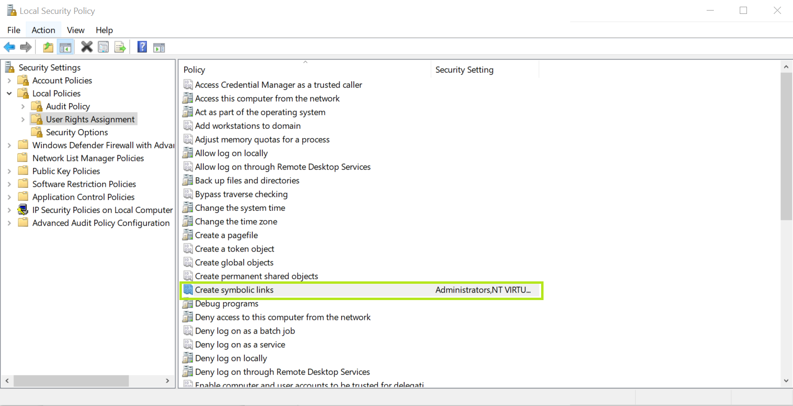

:toc:
toc::[]

= Symlink

The creation of real symbolic links on Windows, requires the user to have according permissions.
In order to grant these permissions to yourself, run `secpol.msc` (`Local Security Policy`) and select `Local Policies/User Rights Assignment`

1. Right click `Create Symbolic Link`, to open `Properties` and `Add User or Group`
+

+
2. Add your own user account.
To do so you might need to be connected to a VPN depending on the company settings.

[cols="3,1a,1a,3",frame=none,grid=none]
|===
|
| image::images/LSPPoperty.png[]
| image::images/LSPAddUser.png[]
|
|===

== Running Tests Without Symlink Permissions

If you are a contributor and want to run the test suite without administrator privileges or enabling symlink permissions, you can still do so.
Tests that require symbolic link creation will be automatically skipped on Windows systems without proper permissions, using the `WindowsSymlinkTestHelper.assumeSymlinksSupported()` utility.

The skipped tests will show a message explaining that symlink permissions are required and reference this documentation.
These tests are still executed in the nightly CI builds on Windows to ensure functionality is validated.

=== Enabling Developer Mode (Alternative to Local Security Policy)

On Windows 10 (Build 14972 or later) and Windows 11, you can enable Developer Mode instead of using Local Security Policy:

1. Open **Settings** > **Update & Security** > **For developers** or search for "developer mode"
2. Enable **Developer Mode**
3. Restart your IDE or terminal

This allows creating symbolic links without administrator privileges for most scenarios.
